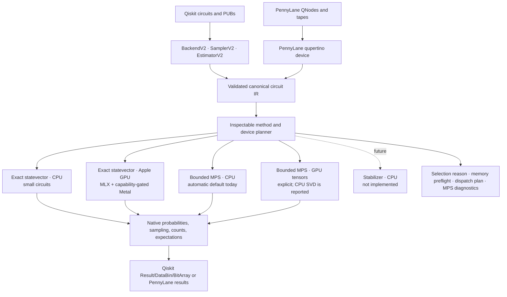
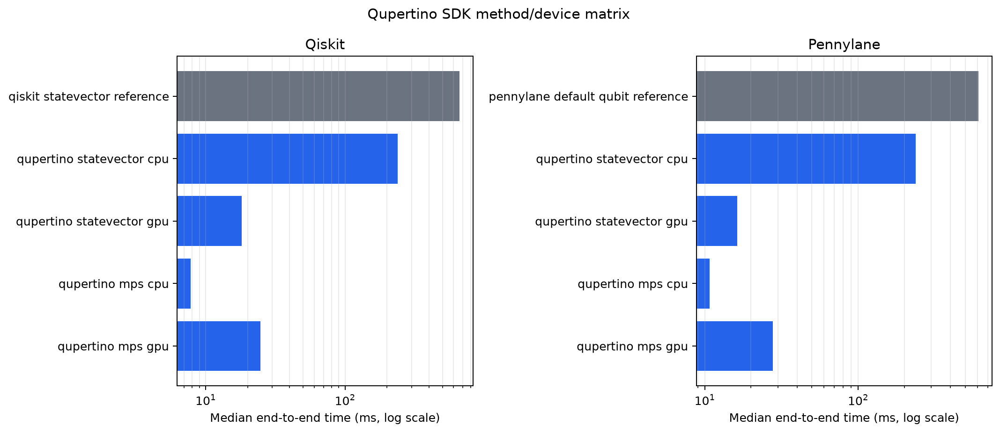
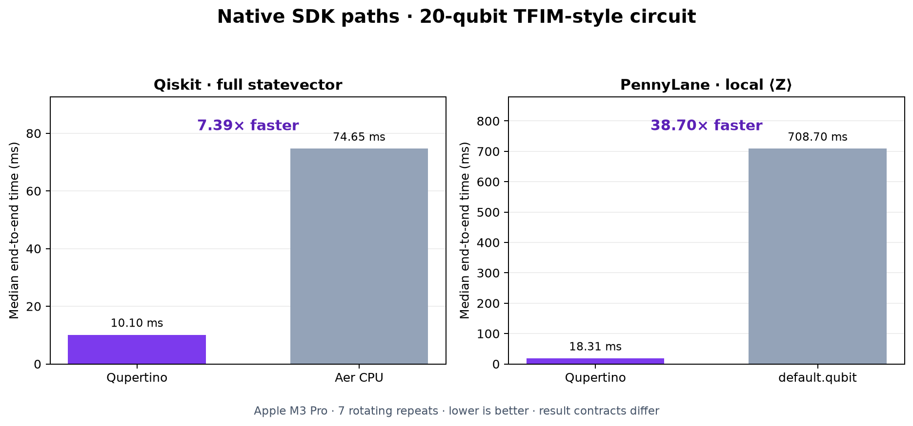

<div align="center">
  
  <h1>Qupertino</h1>
  <p><strong>Fast, inspectable local quantum-circuit simulation for Apple Silicon.</strong></p>
  <p>Qiskit and PennyLane integration, exact statevector and MPS methods, MLX/Metal execution, and reproducible evidence.</p>
  <p>
    <a href="https://github.com/MonitSharma/Qupertino/actions/workflows/ci.yml"></a>
    
    
    
    <a href="LICENSE"></a>
  </p>
  <p>
    <a href="#quick-start">Quick start</a> ·
    <a href="#performance">Performance</a> ·
    <a href="#trust-correctness-and-observability">Trust &amp; correctness</a> ·
    <a href="#sdk-integration-status">SDK status</a> ·
    <a href="#reproducing-the-results">Reproduce</a>
  </p>
</div>


> **Project goal:** build the fastest trustworthy local quantum-simulation
> engine for Apple Silicon, with native Qiskit and PennyLane paths that choose
> the Mac CPU for small work and the integrated GPU only when measured overhead
> is amortized.

Qupertino exposes exact statevector and bounded matrix-product-state (MPS)
simulation through a Qiskit `BackendV2`, Qiskit SamplerV2/EstimatorV2, and a
registered PennyLane device. Every execution selects one numerical device. It
does not add CPU and GPU timings together or market them as cooperative
acceleration.

## At a glance

| Area | Current capability |
| --- | --- |
| Accelerated engine | MLX on Apple Silicon, plus opt-in hand-written Metal kernels |
| Simulation backends | Exact statevector (`sv`) and matrix-product state (`mps`) |
| Circuit inputs | Native Python operations, strict unitary OpenQASM 2.0, Qiskit circuits, and PennyLane QNodes |
| Workloads | QFT, phase estimation, Grover, QAOA, VQE, QCBM, QNN, random circuits, and spin dynamics |
| Trust model | Pre-allocation statevector checks, capability-gated dispatch, explicit cost/execution plans, numerical parity tests, synchronized benchmarks, and safe fallbacks |
| Current test suite | **334 tests** across the simulator, SDK adapters, planner, algorithms, MPS, QASM, Metal dispatch, campaign analysis, and QuantumStudio backend |
| Desktop product | QuantumStudio orchestration, monitoring, plotting, and export |
| SDK adapters | Native Qiskit backend and registered PennyLane device, plus the original internal `mlxq.qml` teaching wrapper |

## Project lineage

This repository is a private development fork of the original public Qupertino
project. The fork is maintained independently and does not open pull requests
against upstream.

| | Repository |
| --- | --- |
| **Private fork** | [MonitSharma/Qupertino](https://github.com/MonitSharma/Qupertino) |
| **Original upstream** | [BoltzmannEntropy/Qupertino](https://github.com/BoltzmannEntropy/Qupertino) |
| **Original website** | [QupertinoWEB](https://boltzmannentropy.github.io/QupertinoWEB/) |
| **Original author** | Shlomo Kashani |
| **Benchmark baseline** | Upstream commit `2b99d30` |
| **25-qubit speed sweep revision** | Fork commit `e5d9577` |
| **Step 3 memory-crossover revision** | Fork commit `a89bbd0` |
| **Step 4 preflight/policy revision** | Fork commit `83940c0` |
| **Step 5 native SDK engine revision** | Fork commit `0d01052` |
| **Step 6 adaptive statevector/MPS revision** | Fork commit `3f40a47` |
| **Step 7 MPS limit campaign revision** | Fork commit `7b3d2ff` |

Original authorship, licensing, and citation information are retained at the
end of this README.

## Quick start

### Requirements

- Apple Silicon Mac (M1, M2, M3, or M4 family)
- macOS 13.3 or newer recommended
- Python 3.9 or newer
- Xcode command-line tools recommended for development and profiling

### Install

```bash
git clone git@github.com:MonitSharma/Qupertino.git
cd Qupertino

python3 -m venv .venv
source .venv/bin/activate
python -m pip install --upgrade pip
python -m pip install -e '.[plot,tests,backend]'
```

For an SDK-focused install without the development and desktop extras:

```bash
python -m pip install -e '.[sdk]'
```

### Use Qupertino from Qiskit

```python
from qiskit import QuantumCircuit, transpile
from mlxq.integrations.qiskit import (
    QupertinoBackend,
    QupertinoEstimatorV2,
    QupertinoSamplerV2,
)

backend = QupertinoBackend(method="automatic", device="auto")
circuit = QuantumCircuit(3, 3)
circuit.h(0)
circuit.cx(0, 1)
circuit.cx(1, 2)
circuit.measure(range(3), range(3))

compiled = transpile(circuit, backend)
result = backend.run(compiled, shots=4096, seed_simulator=7).result()
print(result.get_counts())

# Native Qiskit V2 primitives use the same planner and execution engine.
sampler = QupertinoSamplerV2(backend=backend)
estimator = QupertinoEstimatorV2(backend=backend)
```

Pass `return_statevector=True` only when the caller needs a full state readback.
`execution_report=True` adds the execution plan and statevector preflight to
the native Qiskit result data.

### Use Qupertino from PennyLane

```python
import pennylane as qml

device = qml.device(
    "qupertino",
    wires=3,
    method="automatic",
    device="auto",
)

@qml.qnode(device, diff_method="parameter-shift")
def circuit(theta):
    qml.Hadamard(0)
    qml.CNOT(wires=[0, 1])
    qml.RY(theta, wires=2)
    return qml.expval(qml.Z(0)), qml.probs(wires=[2, 0])

print(circuit(0.3))
```

### Choose a simulation method and device

Qiskit and PennyLane accept the same policy vocabulary:

| Option | Meaning |
| --- | --- |
| `method="automatic"` | Preserve exact statevector semantics unless approximation is explicitly allowed and the circuit passes conservative MPS checks |
| `method="statevector"` | Exact dense statevector with the allocation preflight enforced |
| `method="matrix_product_state"` | Bounded MPS using `mps_max_bond_dimension` and `mps_truncation_threshold` |
| `device="auto"` | Select one measured path: CPU below crossover, GPU above it |
| `device="cpu"` / `"gpu"` | Force one numerical path for testing or a calibrated deployment |

Approximate automatic fallback is opt-in:

```python
backend = QupertinoBackend(
    method="automatic",
    device="auto",
    allow_approximation=True,
    mps_max_bond_dimension=64,
    mps_truncation_threshold=1e-10,
)
```

The current M3 Pro calibration selects statevector GPU execution from 14
qubits. MPS tensor operations can be forced onto CPU or GPU, but MLX 0.32 SVD
runs on CPU and no end-to-end MPS GPU crossover was observed through 32
qubits. Therefore automatic MPS currently stays on CPU unless the caller
supplies a measured `mps_gpu_min_qubits` value. MPS diagnostics expose the
tensor device, SVD device, bond growth, truncation events, discarded-weight
telemetry, and state norm.

Launch the Python process with `MLXQ_METAL_KERNELS=auto` to request custom
Metal kernels when all capability checks pass. Without it, both SDK adapters
use the safe pure-MLX path.

### Run a first accelerated circuit

```bash
MLXQ_METAL_KERNELS=auto PYTHONPATH=src .venv/bin/python - <<'PY'
from mlxq import Device, metal_runtime_status

operations = [
    {"name": "H", "wires": [0]},
    {"name": "CNOT", "wires": [0, 1]},
    {"name": "CNOT", "wires": [1, 2]},
]

device = Device(3)
device.execute(operations, report=True)
device.synchronize()

print("probabilities:", device.sim.probabilities())
print("Metal status:", metal_runtime_status(3)["reason"])
print("execution plan:", device.last_execution_plan)
PY
```

`MLXQ_METAL_KERNELS=auto` requests custom kernels only when the runtime proves
that the platform, GPU device, dtype, backend, indexing, and memory constraints
are compatible. The unset default remains off; unsupported configurations fall
back safely.

Every exact statevector now receives a memory preflight before MLX constructs
the array. It reports the state size, the minimum two-state out-of-place cost,
the device's maximum buffer and recommended working-set limits, and the
remaining lower-bound headroom:

```python
from mlxq import statevector_preflight

report = statevector_preflight(27)
print(report["decision"])
print(report["cost_model"])
```

`StateVectorSimulator` and the `sv` `Device` enforce the same decision before
allocation. A pass means the reported lower bounds do not already rule the
request out; it is not a promise that an arbitrary lazy circuit graph will
fit. If a lower bound exceeds a device limit, Qupertino raises
`StatevectorMemoryError` with the computed sizes and suggests the MPS backend
or fewer qubits. The last-resort `MLXQ_ALLOW_UNSAFE_STATEVECTOR=1` override (or
`Device(..., allow_unsafe_statevector=True)`) is explicit, defaults off, and is
recorded in the preflight and execution plan.

Long lazy Metal graphs can optionally be evaluated at safe custom-launch and
fused-layer boundaries. Multi-launch single-qubit and XX/YY layers stream in
budgeted chunks; no individual Metal launch is split. The budget is an
input/output traffic estimate used to choose evaluation locations, not a
promise that allocator peak will equal the value:

```bash
MLXQ_METAL_KERNELS=auto \
MLXQ_METAL_CHECKPOINT_BUDGET_MB=256 \
PYTHONPATH=src .venv/bin/python your_simulation.py
```

SDK callers can configure the same policy explicitly with
`Device(..., metal_checkpoint_budget_bytes=256 * 1024 * 1024)`. Checkpointing
is opt-in; unset preserves fully lazy execution.

### Verify the checkout

```bash
./test.sh
./bench.sh --circuit ghz --simulate-limit 12 \
  --qubits 2,5,8,10,12 --warmups 1 --repeats 2 --no-save-plots
```

## How execution works



The product surface is deliberately limited to Qiskit and PennyLane for this
phase. Both adapters translate once into the same validated IR, then reuse the
same planner, memory gate, simulator, measurement implementation, and evidence.
Statevector sampling remains on the selected MLX device until shot bits are
returned. MPS marginals, local expectations, and sequential samples contract
the tensor network without constructing a dense `2**n` state.

## Performance

### Current adaptive SDK result: Apple M3 Pro

Commit `3f40a47` was measured through Qiskit and PennyLane using the same
20-qubit, two-step local circuit and the same analytic `⟨Z₀⟩` result contract.
Each implementation received one warmup and seven rotating-order repeats.
Custom Metal was enabled for compatible statevector layers. MPS used
`Dmax=32`, `eps=1e-10`, and recorded zero truncation events and zero discarded
weight on this shallow circuit.

| SDK | Path | Median | Reference / Qupertino | Absolute error |
| --- | --- | ---: | ---: | ---: |
| Qiskit | Statevector CPU | 238.69 ms | 2.77× | `4.42e-11` |
| Qiskit | Statevector GPU | **18.11 ms** | **36.54×** | `4.42e-10` |
| Qiskit | MPS CPU | **7.80 ms** | **84.81×** | `6.22e-8` |
| Qiskit | MPS GPU tensors + CPU SVD | 24.67 ms | 26.83× | `1.12e-7` |
| PennyLane | Statevector CPU | 236.91 ms | 2.58× | `2.79e-9` |
| PennyLane | Statevector GPU | **16.28 ms** | **37.49×** | `1.12e-8` |
| PennyLane | MPS CPU | **10.79 ms** | **56.56×** | `1.95e-7` |
| PennyLane | MPS GPU tensors + CPU SVD | 27.75 ms | 21.99× | `2.26e-7` |

Qiskit rows use `StatevectorEstimator` at 661.79 ms as their reference;
PennyLane rows use `default.qubit` at 610.25 ms. MPS wins this particular
low-entanglement workload because it avoids a dense `2**n` state. It is not a
general random-circuit claim: bond growth, `Dmax`, and truncation determine MPS
cost and accuracy.

<div align="center">
  
  <br/><em>End-to-end SDK timing on a log scale. CPU and GPU are independent alternatives, not cooperative arms.</em>
</div>

#### Why automatic selection uses CPU for small circuits

The same circuit family was swept from 4–20 qubits for statevector and 4–32
qubits for MPS. On the safe pure-MLX default, statevector GPU becomes at least
1.10× faster for consecutive sizes starting at 14 qubits. Compatible custom
Metal layers move this workload-specific crossover to 6 qubits. At 20 qubits,
pure-MLX GPU is 5.53× faster than CPU; compatible Metal GPU is 18.64× faster.

MPS GPU did not cross CPU at any measured size. At 32 qubits, MPS CPU took
10.69 ms and the explicit GPU tensor path took 28.41 ms because SVD remains on
CPU. Accordingly, automatic MPS stays on CPU; explicit GPU remains available
and auditable.

<div align="center">
  
  <br/><em>Safe default policy calibration. Lower is better; both panels use logarithmic time axes.</em>
</div>

The full raw rows, summaries, selection records, MPS diagnostics, manifests,
and charts are frozen in
[`fork-m3pro-20260715-step6-adaptive-sdk/`](assets/benchmarks-frozen/fork-m3pro-20260715-step6-adaptive-sdk/).

#### Unchanged Step 5 protocol: historical versus current session

The older four-step protocol was also rerun unchanged. Qupertino itself was
slower in the current session, so the larger PennyLane ratio must not be read as
an engine improvement:

| SDK contract | Previous Qupertino | Current Qupertino | Current reference | Current speedup | Qupertino change |
| --- | ---: | ---: | ---: | ---: | ---: |
| Qiskit full statevector | 10.10 ms | 11.01 ms | Aer CPU 77.61 ms | 7.05× | 8.98% slower |
| PennyLane local `⟨Z⟩` | 18.31 ms | 21.44 ms | `default.qubit` 1,075.41 ms | 50.15× | 17.12% slower |

This refresh is a session-to-session stability check. The new method-matrix
results above use a different, intentionally shared expectation contract and
must not be compared directly with the Qiskit full-state row.

### Current fork: Apple M3 Pro, 25 qubits

The 2026-07-15 campaign ran 29 workloads with one warmup per arm and ten paired
repeats, alternating pure MLX and custom Metal inside every repeat. The
environment used macOS 26.5.2, Python 3.13.2, and MLX 0.32.0 at fork commit
`e5d9577`. Checkpointing was disabled in both arms for direct comparability.

- Median Metal speedup over pure MLX: **10.17×**
- Geometric-mean Metal speedup: **9.05×**
- Workloads at or above 1.1×: **26 of 29**
- Workloads at or above 4×: **25 of 29**
- Workloads at or above 10×: **19 of 29**
- Maximum: **32.65×** on long-range Ising
- Near parity: amplitude estimation, W state, and ladder Heisenberg

| Representative workload | Pure MLX | Custom Metal | Speedup |
| --- | ---: | ---: | ---: |
| Long-range Ising | 16,439.7 ms | **503.6 ms** | **32.65×** |
| Grover | 3,101.4 ms | **137.0 ms** | **22.64×** |
| EfficientSU2 | 4,670.9 ms | **240.0 ms** | **19.46×** |
| TFIM Trotter, second order | 20,266.3 ms | **1,257.1 ms** | **16.12×** |
| GHZ | 461.9 ms | **27.7 ms** | **16.71×** |
| QFT | 2,052.5 ms | **158.2 ms** | **12.98×** |
| QAOA | 4,307.7 ms | **424.5 ms** | **10.15×** |
| VQE plus energy evaluation | 4,413.9 ms | **1,145.5 ms** | **3.86×** |

<div align="center">
  
  <br/><em>Paired pure-MLX divided by Metal wall time at 25 qubits; larger is better.</em>
</div>

<details>
<summary><strong>Show absolute M3 Pro runtimes</strong></summary>

<div align="center">
  
  <br/><em>Mean synchronized wall time on a log scale; lower is better.</em>
</div>

</details>

#### Stability versus the previous fork campaign

The previous M3 Pro campaign used five repeats at `a73436e`. With a ±0.25×
ratio band, the refreshed ten-repeat result has five higher ratios, 22
unchanged ratios, and two lower ratios. The median ratio moved only +0.0245×.
Both arms were slightly slower in the new session by geometric mean (pure MLX
+3.93%, Metal +3.39%), so this is evidence of stable relative acceleration—not
a controlled claim that Step 2 changed 25-qubit wall time.

<details>
<summary><strong>Show previous fork run versus refreshed evidence</strong></summary>

<div align="center">
  
  <br/><em>Change in paired pure-MLX/Metal speedup on the same M3 Pro; a narrow ±0.25× band is treated as unchanged.</em>
</div>

</details>

### Original upstream versus this fork

The original committed 29-workload chart was measured on an M1 Max. The fork
rerun used an M3 Pro. The comparison below is therefore useful for seeing how
the **relative pure-MLX/Metal speedup changes by workload**, but it is not a
controlled test of absolute version performance.

With a ±0.25× band, the fork rerun has 17 higher ratios, five effectively
unchanged ratios, and seven lower ratios.

<div align="center">
  
  <br/><em>Original published M1 Max ratio → private-fork M3 Pro ratio. Positive does not imply lower cross-machine wall time.</em>
</div>

<details>
<summary><strong>Show the complete 29-workload comparison table</strong></summary>

| Workload | Original upstream, M1 Max | Private fork, M3 Pro | Ratio difference |
| --- | ---: | ---: | ---: |
| Long-range Ising | 24.3× | 32.65× | +8.35× |
| Grover | 11.5× | 22.64× | +11.14× |
| EfficientSU2 | 10.6× | 19.46× | +8.86× |
| GHZ | 9.1× | 16.71× | +7.61× |
| TFIM Trotter (2nd) | 25.0× | 16.12× | -8.88× |
| QCBM | 12.0× | 16.06× | +4.06× |
| Variational | 14.3× | 15.93× | +1.63× |
| QFT (entangled) | 7.3× | 13.46× | +6.16× |
| cuQuantum proxy | 13.2× | 13.10× | -0.10× |
| QFT | 8.4× | 12.98× | +4.58× |
| Quantum walk (V-chain) | 11.6× | 11.49× | -0.11× |
| Phase estimation | 8.0× | 11.03× | +3.03× |
| QNN | 7.4× | 10.27× | +2.87× |
| Graph state | 8.9× | 10.22× | +1.32× |
| Phase estimation (inexact) | 8.8× | 10.17× | +1.37× |
| QAOA | 8.4× | 10.15× | +1.75× |
| Heisenberg XXZ | 13.2× | 10.15× | -3.05× |
| Heisenberg | 13.8× | 10.14× | -3.66× |
| Quantum walk | 11.4× | 10.13× | -1.27× |
| RealAmplitudes | 5.1× | 9.92× | +4.82× |
| Random circuit | 4.7× | 9.18× | +4.48× |
| Deutsch-Jozsa | 8.4× | 8.79× | +0.39× |
| TFIM random field | 13.1× | 8.51× | -4.59× |
| TFIM Trotter (1st) | 12.3× | 8.50× | -3.80× |
| Heisenberg random field | 8.9× | 7.80× | -1.10× |
| VQE plus energy evaluation | 1.3× | 3.86× | +2.56× |
| Heisenberg ladder | 1.0× | 1.00× | +0.00× |
| W state | 1.0× | 1.00× | -0.00× |
| Amplitude estimation | 1.0× | 0.99× | -0.01× |

</details>

### Controlled same-machine revision check

To isolate code changes, the same M3 Pro ran upstream commit `2b99d30` and fork
commit `a73436e` at 20 qubits with one warmup and seven paired repeats. Pure-MLX
medians were broadly stable, while Metal latency increased on all six sampled
workloads:

| Workload | Upstream Metal | Fork Metal | Fork change | Upstream → fork speedup |
| --- | ---: | ---: | ---: | ---: |
| QFT | 4.326 ms | 4.544 ms | +5.0% slower | 5.86× → 5.62× |
| QAOA | 8.902 ms | 9.625 ms | +8.1% slower | 8.86× → 8.21× |
| TFIM Trotter (2nd) | 26.355 ms | 33.028 ms | +25.3% slower | 9.02× → 7.33× |
| Phase estimation | 6.286 ms | 7.031 ms | +11.8% slower | 5.71× → 5.11× |
| Grover | 4.815 ms | 5.367 ms | +11.5% slower | 12.69× → 11.29× |
| GHZ | 1.628 ms | 2.293 ms | +40.8% slower | 5.96× → 4.06× |

The correctness and observability revision above did not improve raw Metal
latency. The first follow-up optimization now caches process-stable hardware
facts while preserving live policy, selected-device, backend, dtype, dense
ablation, and circuit-size checks. In a same-process 20-qubit A/B with 15
alternating repeats, selector latency fell from 0.2139 ms to 0.001583 ms
(135×); the six sampled workloads improved by 4.6%–16.4%. These are focused
hot-path measurements.

A separate 29-workload, 20-qubit A–B–B–A revision check used two independent
seven-repeat campaigns per revision. Against upstream `2b99d30`, the Step 1
working tree was faster on 28 of 29 Metal workloads: median latency was 2.6%
lower and geometric-mean latency was 4.1% lower. All six regressions in the
historical table above recovered; VQE was the sole slower row at 0.17%. This
validates the overall working tree but does not attribute every revision
difference to the cache. The complete protocols and per-workload medians are
in the [Apple GPU engineering log](docs/development/apple-gpu-plan.md).

### Memory-budgeted Metal graphs

Step 2 adds opt-in evaluation checkpoints between fused operations. A
20-qubit, six-step TFIM crossover sweep used nine rotating repeats per arm on
the same M3 Pro. A 256 MiB estimated-I/O budget was the conservative measured
operating point: predicted and observed checkpoint counts matched exactly.

| Policy | Checkpoints | Median peak | Peak reduction | Median runtime | Runtime change |
| --- | ---: | ---: | ---: | ---: | ---: |
| Fully lazy | 0 | 616 MiB | — | 29.03 ms | — |
| 512 MiB budget | 2 | 264 MiB | 57.1% | 26.67 ms | 8.1% faster |
| 384 MiB budget | 3 | 184 MiB | 70.1% | 24.79 ms | 14.6% faster |
| **256 MiB budget** | **6** | **96 MiB** | **84.4%** | **22.71 ms** | **21.8% faster** |
| 128 MiB budget | 13 | 88 MiB | 85.7% | 26.52 ms | 8.7% faster |

All arms matched the pure-MLX statevector within `5.16e-9` maximum amplitude
error. QFT and affine validation errors were exactly zero. The sweep is
reproducible with `tools/checkpoint_sweep.py`; full protocol and guardrail
results are in the [Apple GPU engineering log](docs/development/apple-gpu-plan.md).

The first Step 2 test at 25 qubits exposed a deeper floor: boundary-only
checkpointing left every arm near 3.00 GiB because one logical H/RX layer held
13 custom launches in a single lazy graph. Step 3 keeps the same kernels but
streams that layer at safe boundaries between launches when a budget is
configured. It never splits an individual Metal launch.

The exact-commit Step 3 crossover at `a89bbd0` used the same six-step TFIM
workload, one warmup, and seven rotating repeats per arm:

| Policy | Median peak | Peak reduction | Median runtime | Runtime change |
| --- | ---: | ---: | ---: | ---: |
| Fully lazy | 3,072 MiB | — | 475.468 ms | — |
| 4 GiB budget | 2,304 MiB | 25.0% | 452.044 ms | 4.9% faster |
| 2 GiB budget | 1,536 MiB | 50.0% | 439.981 ms | 7.5% faster |
| **1 GiB budget** | **1,024 MiB** | **66.7%** | **443.556 ms** | **6.7% faster** |
| 512 MiB budget | 768 MiB | 75.0% | 454.365 ms | 4.4% faster |
| 256 MiB budget | 768 MiB | 75.0% | 453.889 ms | 4.5% faster |

All 42 measured arms matched their predicted checkpoint counts and agreed with
pure MLX within `1.41e-9` maximum amplitude error. The 1 GiB policy is the
balanced measured point; 512 MiB minimizes measured peak. Fully lazy execution
remains the default, and the budget remains a scheduling estimate rather than
a hard allocator cap.

<div align="center">
  
  <br/><em>Median allocator peak and synchronized wall time for the rotating 25-qubit TFIM crossover.</em>
</div>

Step 4 broadens that single workload into 36 isolated workload/qubit cells:
TFIM, QFT, QAOA, QCBM, Heisenberg, and SU(2), each from 22 through 27 qubits.
Every cell used a fresh Python/MLX process, one warmup per arm, three rotating
repeats, and paired runtime analysis. The exact engine revision was `83940c0`.

| Adaptive policy | Median peak reduction | Minimum cell reduction | Paired geometric-mean runtime | Paired cells faster | Worst paired cell |
| --- | ---: | ---: | ---: | ---: | ---: |
| Balanced: `max(256 MiB, 4 × state)` | 71.79% | 50.00% | 16.46% faster | 35 / 36 | 7.59% slower |
| Minimum: `max(128 MiB, 2 × state)` | **77.50%** | **58.33%** | 14.64% faster | **36 / 36** | **1.48% faster** |

All 324 measured executions had identical predicted and observed checkpoint
counts. Maximum amplitude error was `1.03e-6` (limit `5e-6`) and maximum norm
error was `6.91e-6` (limit `1e-5`). Pure MLX was the full-state reference
through 24 qubits; 25–27 qubits used the identical fully lazy Metal kernels,
which validates scheduling parity rather than independently revalidating Metal
algebra at those sizes.

Both formulas qualify for wider hardware testing on the measured M3 Pro.
Automatic checkpointing remains disabled by default until M1/M2/M3/M4 and
different unified-memory sizes are tested; users can select the measured byte
formulas through the existing explicit budget API.

<div align="center">
  
  <br/><em>Median peak reduction and paired runtime change across six isolated workloads at each size.</em>
</div>

<details>
<summary><strong>Show the original upstream four-backend M1 Max result</strong></summary>

The original project reported an interleaved M1 Max campaign against Qiskit Aer
CPU and PennyLane `lightning.qubit`. Its unpublished `paper/` evidence tree is
not distributed in this checkout, so this is retained as a historical upstream
claim rather than a newly reproduced four-backend result.

<div align="center">
  
</div>

| Workload @ 25q | Qupertino Metal | Qupertino MLX | Aer CPU | PennyLane lightning |
| --- | ---: | ---: | ---: | ---: |
| QFT | **0.059 s** | 0.72 s | 2.80 s | 5.61 s |
| Ring-QAOA, 6 layers | **0.150 s** | 2.07 s | 5.35 s | 6.84 s |
| TFIM Trotter, 20 steps | **0.495 s** | 5.82 s | 17.79 s | 32.95 s |
| Phase estimation | **0.105 s** | 0.91 s | 4.05 s | 6.06 s |
| Grover proxy | **0.052 s** | 1.11 s | 1.21 s | 2.73 s |
| GHZ | **0.022 s** | 0.27 s | 0.69 s | 0.42 s |

</details>

### Native SDK paths: exact-commit M3 Pro evidence

Engine commit `0d01052` was measured through the public Qiskit and PennyLane
interfaces, not the direct operation API. The 20-qubit, four-step TFIM-style
circuit used one warmup and seven repeats with implementation order reversed on
alternating repeats. Timings include SDK translation, execution,
synchronization, and the requested native result.

| SDK-native result | Qupertino median | CPU reference median | Speedup | Numerical check |
| --- | ---: | ---: | ---: | --- |
| Qiskit full statevector | **10.10 ms** | Aer 74.65 ms | **7.39×** | max amplitude error `1.287e-8` |
| PennyLane local `⟨Z⟩` | **18.31 ms** | `default.qubit` 708.70 ms | **38.70×** | expectation error `4.657e-9` |

<div align="center">
  
  <br/><em>Scoped comparisons within each SDK. The Qiskit and PennyLane result contracts differ and are not compared to each other.</em>
</div>

This is evidence for one Apple M3 Pro, circuit family, and package set—not a
universal claim across Apple chips or SDK configurations. The raw timings,
summary, validation thresholds, exact command, versions, and clean-engine
manifest are frozen in
[`fork-m3pro-20260715-step5-sdk/`](assets/benchmarks-frozen/fork-m3pro-20260715-step5-sdk/).

### How far does MPS go? Entanglement limits on Apple M3 Pro

There is no honest single MPS qubit limit. A 10,000-qubit GHZ chain needs bond
dimension 2, while a much smaller nonlocal circuit can saturate `Dmax`, lose
norm, or fail its SVD. Step 7 therefore swept seven deterministic topologies
through the public Qiskit `QupertinoEstimatorV2` path, with every case isolated
in a fresh process.

The completion-envelope runs used CPU MPS, `Dmax=64`, `eps=1e-10`, and a
30-second per-case ceiling. CPU is the current automatic choice because the
measured GPU tensor path still returns to the CPU for every SVD and did not
cross over. These are the largest completed cases in the tested schedules,
not universal maxima:

| Entanglement family | Largest observed completion | Time | Accuracy / failure boundary |
| --- | ---: | ---: | --- |
| GHZ chain | 10,000q d1 | **2.309 s** | Bond 2, no local truncation; this was the test ceiling, not an engine limit |
| 1D brickwork | 1,000q d8 | **1.096 s** | Bond 60, norm 1.000062; 10,000q d8 later reached a zero numerical norm |
| Ring brickwork | 1,000q d4 | 13.344 s | Bond cap, norm 0.0169; completion is not a usable answer, and SVD failures were non-monotonic |
| 2D grid | 81q d2 | 1.467 s | Bond cap, norm 0.775; 100q and 144q hit MLX SVD failures |
| Rainbow pairs | 64q d1 | 4.025 s | Bond cap, norm 0.930; 80q and 96q hit MLX SVD failures |
| Seeded long range | 96q d1 | 5.935 s | Bond cap, norm 0.868; 128q and 160q hit MLX SVD failures |
| All to all | 32q d1 | 20.969 s | Bond cap, norm 0.573; 36q exceeded 30 seconds |

The standard 26-case sweep completed every case, but independent Qiskit
statevector checks through 20 qubits found up to `1.278e-2` local-observable
error after aggressive nonlocal truncation. At 16 qubits, line, ring, and grid
cases passed the `5e-5` acceptance threshold; rainbow, random-long-range, and
all-to-all cases did not all pass at `Dmax=64`.

<div align="center">
  
  <br/><em>Filled points show no observed local truncation; hollow points show truncation. X and triangle markers retain numerical failures and the 30-second timeout.</em>
</div>

`Dmax` convergence is part of trust, not an optional performance tweak. For
example, the 24-qubit all-to-all case rose from 2.406 s at `Dmax=32`, to 7.530 s
at 64, to 26.126 s at 128, yet remained strongly truncated. Increasing `Dmax`
did not make every observable or norm converge monotonically.

<div align="center">
  
  <br/><em>Representative convergence probes. Wide cases without an independent reference are not labeled exact.</em>
</div>

The reviewed raw rows, manifests, summaries, plotted CSVs, commands, and
interpretation are frozen in
[`fork-m3pro-20260715-step7-mps-limits/`](assets/benchmarks-frozen/fork-m3pro-20260715-step7-mps-limits/).

The next MPS engineering priorities are: make SVD failure recoverable and
renormalization/canonicalization explicit; add `Dmax` convergence and accuracy
policy to SDK results; plan nonlocal gates to minimize swap-induced bond
growth; then optimize the two-site/SVD path and remeasure an honest Apple-GPU
crossover. A matched Qupertino-versus-Aer MPS campaign should follow only after
those reliability failures are fixed.

## Trust, correctness, and observability

Fast simulation is useful only when dispatch, semantics, and measurements are
auditable. This fork adds explicit evidence at each layer:

- **Safe Metal selection:** platform, device, API, dtype, backend, qubit-index,
  memory, and ablation-policy checks must all pass.
- **Explicit method/device selection:** SDK results record the requested and
  selected method, selected CPU or GPU, and the reason for that decision.
- **Inspectable plans:** `Device.explain()` reports recognized patterns,
  selected kernels, fallbacks, expected dispatches, and memory estimates without
  executing the circuit.
- **Synchronized proof:** `execute(..., report=True)` plus `synchronize()`
  records concrete host dispatches and completes pending MLX work.
- **Auditable memory control:** checkpoint plans predict safe fused-layer
  boundaries, and execution reports record every actual evaluation, duration,
  estimated traffic, and allocator snapshot.
- **Numerical parity:** custom kernels are tested against pure MLX, including
  all-distinct-angle and long-product stress cases.
- **Strict QASM:** unsupported dynamic semantics are rejected with source-aware
  errors instead of being silently ignored.
- **Hermetic tests:** generated files use temporary directories, and successful
  tests leave the checkout unchanged.

### Test inventory

| Category | Tests |
| --- | ---: |
| Core simulator and gate algebra | 149 |
| Quantum-computing examples and algorithms | 41 |
| Internal consistency and measurement parity | 21 |
| MPS backend and correctness | 16 |
| QML wrapper, QFT, and subset semantics | 10 |
| Strict OpenQASM and silent-risk checks | 7 |
| QPE energy estimation | 2 |
| Benchmark protocol and plotting | 9 |
| Custom Metal parity and dispatch | 19 |
| Execution plans, memory policy, planner, and capability reporting | 29 |
| Native Qiskit and PennyLane integrations | 13 |
| QuantumStudio backend and MCP API | 18 |
| **Total** | **334** |

Run everything with:

```bash
./test.sh
```

CI runs portable backend checks on hosted Linux. Full simulator and custom-Metal
validation is available as a manually triggered job for a self-hosted Apple
Silicon runner labeled `macOS` and `ARM64`.

### Known limits

- Hand-written Metal kernels currently accelerate exact statevector patterns,
  not MPS. MPS tensors support explicit CPU/GPU MLX execution, while MLX 0.32
  SVD runs on CPU; the split is visible in diagnostics.
- MPS is bounded and may be approximate. Local discarded singular-value weight
  is telemetry, not a global fidelity bound. Automatic MPS requires
  `allow_approximation=True` and conservative locality/depth checks.
- The current MLX 0.32 CPU SVD can abort selected wide, nonlocal MPS cases with
  `sgesvdx` convergence code 1. Deep/wide truncated cases can also lose norm;
  process isolation contains the failure, and Step 7 retains it as evidence,
  but a robust SVD fallback and canonical renormalization are not implemented.
- The bundled strict importer accepts 33 of 42 OpenQASM files. It rejects reset,
  classical control, mid-circuit measurement, opaque gates, arbitrary includes,
  and malformed declarations.
- The Qiskit backend and V2 primitives support statevector and MPS execution.
  The backend accepts unitary circuits with final measurements; reset,
  mid-circuit measurement, classical control, and noise are rejected. The
  PennyLane device supports both methods, common decomposable unitary gates, state,
  probabilities, samples, counts, expectations, variances, shot vectors, and
  framework-managed parameter-shift gradients; dynamic wires, mid-circuit
  measurement, backpropagation, and device adjoint gradients are not yet
  implemented.
- Checkpoint budgets use conservative statevector input/output traffic as a
  scheduling signal; they are not hard allocator ceilings. Supported
  multi-launch layers can evaluate between launches, but one custom kernel
  launch remains the irreducible out-of-place input/output floor.
- Cross-machine charts compare relative speedup only; absolute performance
  claims require the same machine and benchmark protocol.

## SDK integration status

| Integration | Status | Intended experience |
| --- | --- | --- |
| Native `mlxq` Python operations | Available | Execute validated operation dictionaries directly |
| OpenQASM 2.0 | Available, strict unitary subset | Import supported circuits with explicit rejection of dynamic semantics |
| `mlxq.qml` | Available, internal wrapper | PennyLane-like tapes, measurements, templates, and parameter-shift gradients |
| Qiskit `BackendV2` | Available: statevector + MPS | Transpile and run unitary circuits; receive native `Result`, device-sampled counts/memory, optional statevector, and execution evidence |
| Qiskit SamplerV2 / EstimatorV2 | Available | Use PUB batching, native `BitArray` samples, and exact device-resident Pauli expectations |
| PennyLane `qupertino` device | Available: statevector + MPS | Use a normal QNode with analytic or finite-shot measurements, tracking, capability declarations, and framework-managed parameter-shift gradients |
| Other SDKs | Out of scope for the current phase | Qiskit and PennyLane are the only active integration targets |

Both adapters translate through one tested canonical operation layer. Qiskit's
little-endian state and classical-bit conventions and PennyLane's declared wire
order are covered by reference-parity tests. Unsupported semantics raise native
SDK errors, while statevector preflight, capability-gated dispatch, checkpoint
policy, and execution reports remain in the core rather than being reimplemented
or bypassed by an adapter.

## Running benchmarks

### Reproducible single workload

```bash
MLXQ_METAL_KERNELS=1 ./bench.sh \
  --circuit qft --qubits 15,20,25 --warmups 1 --repeats 5
```

### Full orchestrated run

```bash
./bench_with_logging.sh
```

### Calibrate CPU/GPU selection

```bash
MLXQ_METAL_KERNELS=auto PYTHONPATH=src .venv/bin/python \
  tools/benchmark_execution_policy.py \
  --outdir bench/runs/execution-policy \
  --warmups 1 --repeats 7
```

This paired rotating sweep reports a sustained crossover only when GPU is at
least 1.10× faster for two consecutive measured sizes. A `null` MPS crossover
means automatic MPS should remain on CPU over the tested range.

### Benchmark Qiskit and PennyLane method/device paths

```bash
MLXQ_METAL_KERNELS=auto PYTHONPATH=src .venv/bin/python \
  tools/benchmark_sdk_method_matrix.py \
  --outdir bench/runs/sdk-method-matrix \
  --qubits 20 --steps 2 --warmups 1 --repeats 7
```

The SDK matrix uses the same analytic local `Z` expectation contract in both
frameworks. Qiskit rows compare with `StatevectorEstimator`; PennyLane rows
compare with `default.qubit`.

### Probe MPS limits by entanglement topology

```bash
PYTHONPATH=src caffeinate -i .venv/bin/python \
  tools/benchmark_mps_limits.py \
  --outdir bench/runs/mps-limits \
  --profile standard --dmax 64 --eps 1e-10 --timeout-seconds 30

# Repeat --case to narrow a boundary without editing the benchmark.
PYTHONPATH=src .venv/bin/python tools/benchmark_mps_limits.py \
  --outdir bench/runs/mps-boundary --dmax 64 --timeout-seconds 30 \
  --case grid_2d:81:2 --case rainbow:80:1 --case all_to_all:36:1
```

The campaign separates completion, timeout, process error, small exact
validation, local truncation, bond growth, state norm, runtime, and peak RSS.

### Statevector or MPS backend

```bash
./bench.sh --circuit qaoa --backend sv  --qubits 8,12,16 --repro
./bench.sh --circuit qaoa --backend mps --qubits 8,12,16 --repro \
  --mps-dmax 64 --mps-eps 1e-10
```

### OpenQASM suite

```bash
./bench.sh --qasm-suite --qasm-max-qubits 18 --qasm-timeout-ms 30000
```

### Apple GPU inspection

```bash
PYTHONPATH=src .venv/bin/python tools/profile_apple_gpu.py \
  --qubits 20 --repeats 7 --output /tmp/qupertino-profile.json
```

The profiler records synchronized cold/warm timing, allocator memory, estimated
state traffic, full-state CPU readback, dispatch evidence, and pure-MLX parity.
Use the paired benchmark sweep—not a profiler run—for publication claims.

### Benchmark families

| Category | Circuit keys |
| --- | --- |
| Spin and Hamiltonian dynamics | `hamiltonian_simulation`, `time_evolution`, `trotter`, `steady_state`, `heisenberg`, `heisenberg_xxz`, `heisenberg_random_field`, `tfim`, `tfim_trotter2`, `tfim_random_field`, `long_range_ising`, `ladder_heisenberg` |
| Variational and QML | `qcbm`, `qaoa`, `vqe`, `variational_circuit` |
| Algorithms and circuits | `qft`, `phase_estimation`, `grover`, `ghz`, `random_circuit` |

Run any family with `./bench.sh --circuit <key>`. Use `./bench.sh --help` for
qubit schedules, caps, MPS controls, QASM options, and reproducibility settings.

## Reproducing the results

The complete 2026-07-15 speed-sweep evidence bundle is tracked under
[`assets/benchmarks-frozen/fork-m3pro-20260715/`](assets/benchmarks-frozen/fork-m3pro-20260715/):

- 290 paired raw timing rows
- 29-workload summary CSV
- exact-commit run manifest and aggregate evidence summary
- transcribed historical ratios with source attribution
- historical/current comparison CSV and JSON summary
- prior-fork/current comparison CSV and JSON summary
- 25-qubit checkpoint crossover raw data, validation, summary, and manifest

The Step 3 memory and default-path evidence is tracked separately under
[`assets/benchmarks-frozen/fork-m3pro-20260715-step3/`](assets/benchmarks-frozen/fork-m3pro-20260715-step3/). It contains the exact-commit 20- and
25-qubit crossovers, four raw A–B–B–A guardrail campaigns, numerical
validation, drift-balanced comparison output, and the plotted source data.

The Step 4 preflight and 22–27-qubit cross-workload evidence is frozen under
[`assets/benchmarks-frozen/fork-m3pro-20260715-step4/`](assets/benchmarks-frozen/fork-m3pro-20260715-step4/). It contains 324 raw timing rows, reviewed paired summaries, 90 full-state validation rows, the exact-commit and 36 child manifests, M3 Pro preflight reports through 31 qubits, and the plotted source data.

The Step 5 native-SDK evidence is frozen under
[`assets/benchmarks-frozen/fork-m3pro-20260715-step5-sdk/`](assets/benchmarks-frozen/fork-m3pro-20260715-step5-sdk/). It contains rotating-order Qiskit and PennyLane timings, separate native-result comparisons, numerical validation, the exact engine manifest, and a chart generated from the summary JSON.

The Step 6 adaptive statevector/MPS evidence is frozen under
[`assets/benchmarks-frozen/fork-m3pro-20260715-step6-adaptive-sdk/`](assets/benchmarks-frozen/fork-m3pro-20260715-step6-adaptive-sdk/). It contains pure-MLX and custom-Metal CPU/GPU crossover sweeps, the Qiskit/PennyLane method matrix, MPS device and truncation diagnostics, the unchanged Step 5 protocol refresh, and the 329-test result.

The Step 7 MPS entanglement-limit evidence is frozen under
[`assets/benchmarks-frozen/fork-m3pro-20260715-step7-mps-limits/`](assets/benchmarks-frozen/fork-m3pro-20260715-step7-mps-limits/). It contains 49 `Dmax=64` topology/qubit/depth probes, `Dmax=32/64/128` convergence rows, independent statevector validation through 20 qubits, retained SVD/norm failures, exact-commit manifests, and the plotted source data.

Recreate the current sweep and comparison:

```bash
unset MLXQ_METAL_CHECKPOINT_BUDGET_MB MLXQ_DENSE_ONLY
PYTHONPATH=src caffeinate -i .venv/bin/python tools/shader_suite_sweep.py \
  --outdir bench/runs/shader_sweep_current --qubits 25 --repeats 10

PYTHONPATH=src .venv/bin/python tools/compare_shader_sweeps.py \
  --historical assets/benchmarks-frozen/fork-m3pro-20260715/historical_chart_ratios.csv \
  --current bench/runs/shader_sweep_current/shader_sweep_summary.csv \
  --outdir bench/runs/shader_sweep_current \
  --historical-label "upstream M1 Max chart" \
  --current-label "fork M3 Pro current"

PYTHONPATH=src .venv/bin/python tools/checkpoint_sweep.py \
  --outdir bench/runs/checkpoint_sweep_n25 --qubits 25 --steps 6 \
  --repeats 7 --warmups 1 --budgets-mib 4096 2048 1024 512 256

PYTHONPATH=src .venv/bin/python tools/plot_checkpoint_sweep.py \
  --summary bench/runs/checkpoint_sweep_n25/checkpoint_sweep_summary.csv \
  --output bench/runs/checkpoint_sweep_n25/checkpoint_tradeoff.png \
  --title "25-qubit TFIM: intra-layer Metal streaming"

PYTHONPATH=src caffeinate -i .venv/bin/python \
  tools/memory_policy_campaign.py \
  --outdir bench/runs/memory_policy_current \
  --qubits 22 23 24 25 26 27 --repeats 3 --warmups 1

PYTHONPATH=src .venv/bin/python tools/plot_memory_policy_campaign.py \
  --summary bench/runs/memory_policy_current/memory_policy_summary.csv \
  --output bench/runs/memory_policy_current/memory_policy.png

MLXQ_METAL_KERNELS=auto PYTHONPATH=src caffeinate -i .venv/bin/python \
  tools/benchmark_sdk_adapters.py \
  --outdir bench/runs/sdk-adapters \
  --qubits 20 --steps 4 --warmups 1 --repeats 7

PYTHONPATH=src .venv/bin/python tools/plot_sdk_adapters.py \
  --summary bench/runs/sdk-adapters/sdk_adapter_summary.json \
  --output bench/runs/sdk-adapters/sdk_adapter_timings.png

unset MLXQ_METAL_KERNELS
PYTHONPATH=src .venv/bin/python tools/benchmark_execution_policy.py \
  --outdir bench/runs/execution-policy-pure-mlx --warmups 1 --repeats 7

MLXQ_METAL_KERNELS=auto PYTHONPATH=src .venv/bin/python \
  tools/benchmark_execution_policy.py \
  --outdir bench/runs/execution-policy-metal --warmups 1 --repeats 7

MLXQ_METAL_KERNELS=auto PYTHONPATH=src .venv/bin/python \
  tools/benchmark_sdk_method_matrix.py \
  --outdir bench/runs/sdk-method-matrix \
  --qubits 20 --steps 2 --warmups 1 --repeats 7
```

Transient runs belong under `bench/runs/`. Promote only reviewed evidence to
`assets/benchmarks-frozen/`; keep historical sample bundles immutable.

## QuantumStudio

QuantumStudio is the desktop companion for launching runs, monitoring progress,
viewing results, and exporting artifacts.

```bash
cd quantumstudio
./bin/appctl up
./bin/appctl status
./bin/appctl logs backend
./bin/appctl down
```

Build local UI artifacts with:

```bash
./scripts/build_flutter_app.sh --release
./scripts/build_dmg.sh
```

<details>
<summary><strong>Show the QuantumStudio gallery</strong></summary>


</details>

## Repository map

| Path | Purpose |
| --- | --- |
| `src/mlxq/` | Simulator, gates, statevector, MPS, QASM, QML wrapper, execution plans, and Metal shaders |
| `src/mlxq/integrations/` | Shared adapter layer, Qiskit `BackendV2`, and PennyLane device plugin |
| `src/tests/` | Simulator, algorithm, correctness, protocol, and Metal tests |
| `tools/` | GPU profiler, sweep runners, SDK benchmark, comparison plots, and supporting utilities |
| `bench.sh` | Main benchmark launcher |
| `bench_with_logging.sh` | Orchestrated benchmark and promotion workflow |
| `bench/runs/` | Ignored transient run output |
| `assets/benchmarks-frozen/` | Reviewed evidence and immutable sample bundles |
| `assets/perf-charts/` | README-ready performance figures |
| `datasets/qasm/local/` | Bundled OpenQASM corpus |
| `quantumstudio/` | Desktop UI, backend API, MCP server, and packaging scripts |
| `.github/workflows/ci.yml` | Portable CI and manually triggered Apple Silicon validation |

## Development

```bash
# All tests
./test.sh

# Simulator only
python -m pytest src/tests -q

# QuantumStudio backend only
python -m pytest quantumstudio/tests -q

# One targeted module
./test.sh -- src/tests/mlxQMetalKernelsTest.py
```

Ordinary tests and generated plots use temporary directories. A successful full
test run should leave `git status --short` unchanged.

## Citation

The original project citation remains:

```bibtex
@software{kashani_qupertino_2026,
  author       = {Shlomo Kashani},
  title        = {Qupertino / QuantumStudio: Apple Silicon Quantum Benchmarking Stack},
  year         = {2026},
  url          = {https://github.com/BoltzmannEntropy/Qupertino},
  note         = {GitHub repository}
}
```

The associated technical report is self-published but unpublished; its PDF and
LaTeX source are not distributed in this repository.

## License

Qupertino / QuantumStudio is free and open source under the [MIT License](LICENSE).
The source and compiled macOS binaries may be used, modified, and redistributed,
including commercially, under the license terms.
