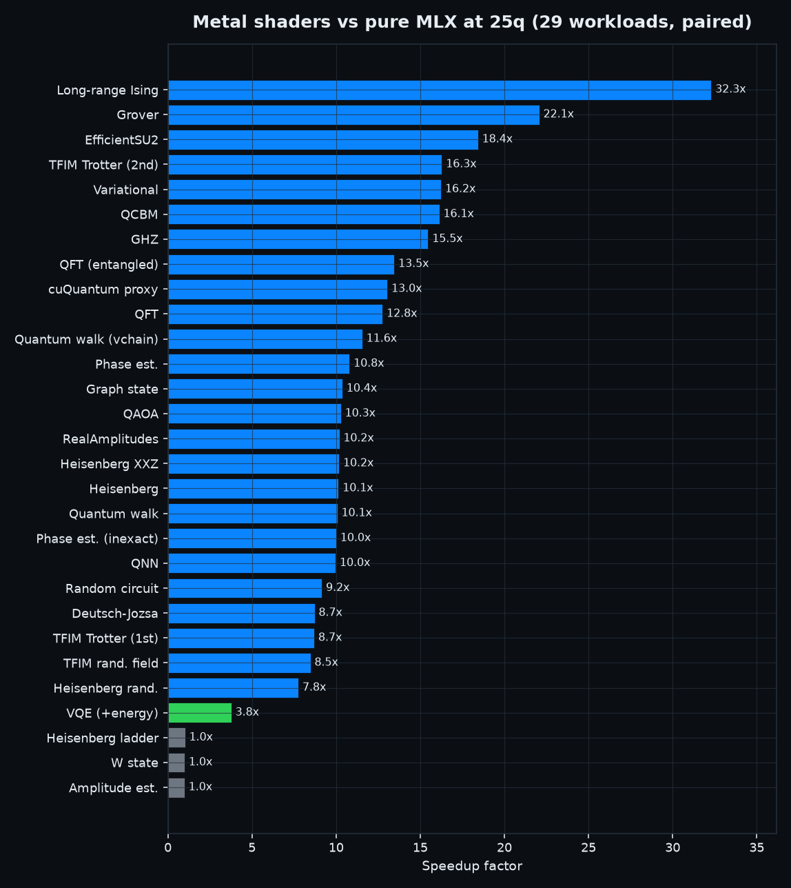
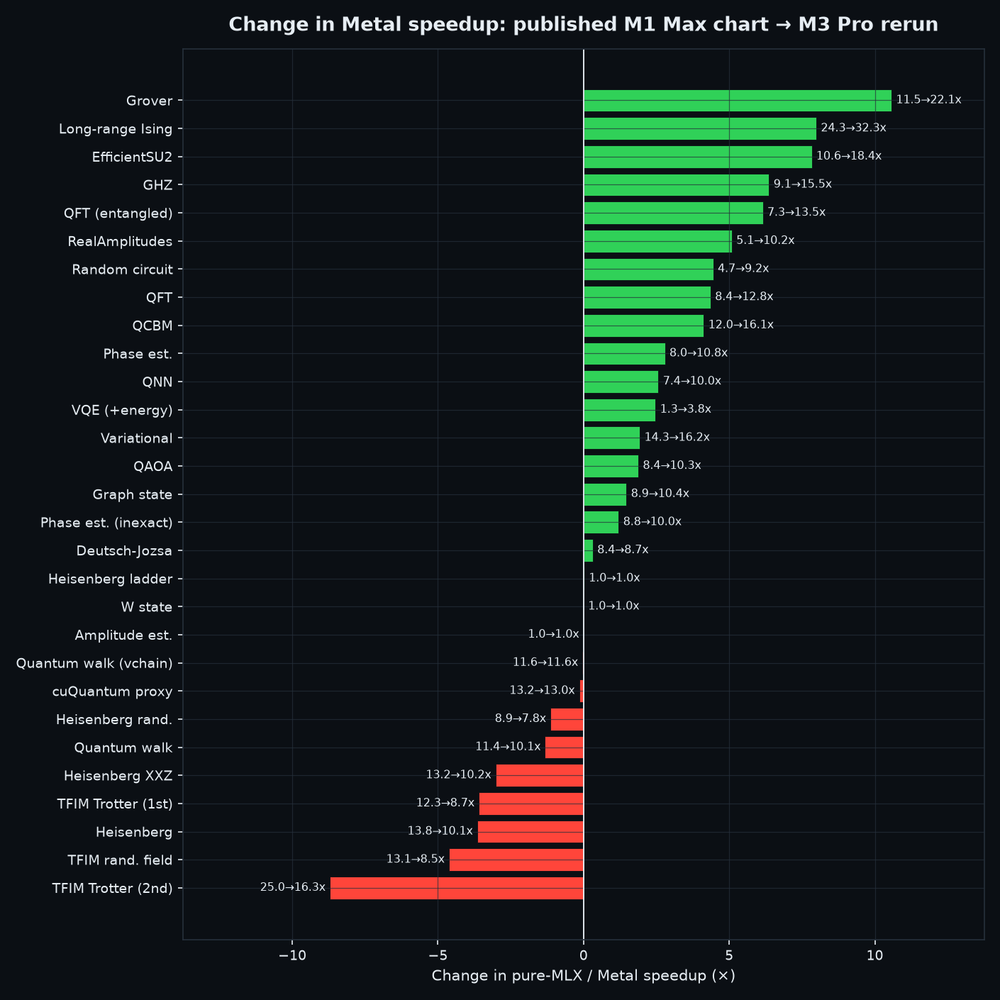
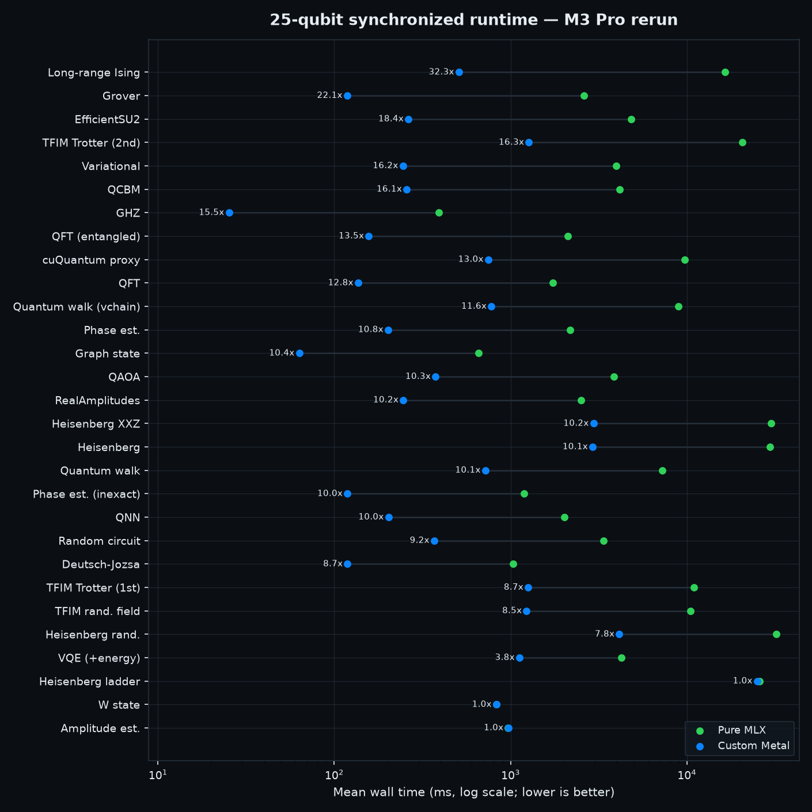

<div align="center">
  
  <h1>Qupertino / QuantumStudio</h1>
  <p><b>Apple Silicon quantum benchmarking stack</b> with a local simulator, reproducible benchmark pipelines, and a desktop UI.</p>
</div>


Qupertino is a three-part project: a self-published technical report, the Qupertino simulator stack, and the dedicated QuantumStudio desktop UI studio. There is no native MLX quantum simulator available today, so Qupertino provides a local simulator layer for QFT, QAOA, VQE, Hamiltonian workflows, and OpenQASM runs.

The simulator has **two performance tiers on the same hardware**. The pure-MLX
tier expresses structured gates as MLX array operations; an opt-in tier of
**hand-written Metal shaders** (`src/mlxq/shaders/`, enabled with
`MLXQ_METAL_KERNELS=1`) adds semantics-preserving fusion and custom kernels.
The original repository published strong M1 Max results. This fork preserves
that historical evidence and adds a 2026-07-14 M3 Pro rerun, a complete
29-workload comparison, and a controlled same-machine upstream-versus-fork
check. The current Metal tier reaches a median **10.19×** speedup over pure MLX
and a maximum **32.30×**, while the controlled revision check also identifies a
measurable host-side regression that remains an optimization target.

## Project Lineage

- **This private fork:** https://github.com/MonitSharma/Qupertino
- **Original public repository (upstream):** https://github.com/BoltzmannEntropy/Qupertino
- **Original project website:** https://boltzmannentropy.github.io/QupertinoWEB/
- **Original author:** **Shlomo Kashani**
- **Comparison baseline:** upstream commit `2b99d30`
- **Measured fork revision:** `a73436e`
- **Technical report:** unpublished; PDF and LaTeX source are not distributed in this repository

This is a private development fork maintained independently for correctness,
Apple GPU performance, observability, and future quantum-SDK integrations. It
does not open pull requests against the original repository. Original authorship
and citation information are retained below.

## How to Cite

### Repository (Git / Software Citation)

```bibtex
@software{kashani_qupertino_2026,
  author       = {Shlomo Kashani},
  title        = {Qupertino / QuantumStudio: Apple Silicon Quantum Benchmarking Stack},
  year         = {2026},
  url          = {https://github.com/BoltzmannEntropy/Qupertino},
  note         = {GitHub repository}
}
```

### Technical Report Citation

```bibtex
@techreport{kashani_qupertino_report_2026,
  author       = {Shlomo Kashani},
  title        = {Qupertino: Pure MLX Array Kernels versus Hand-Tuned Metal Shaders for Quantum Circuit Simulation on Apple Silicon},
  year         = {2026},
  institution  = {Self-published technical report (unpublished)},
  url          = {https://github.com/BoltzmannEntropy/Qupertino}
}
```

## Extended Introduction

Qupertino exists to make Apple Silicon quantum benchmarking practical, local-first, and reproducible. The project packages three layers into one workflow:

1. **Research layer**: benchmark methodology and framing (see the included technical report).
2. **Simulator layer (`mlxq`)**: state-vector and MPS backends on MLX for Apple Silicon, in two performance tiers — pure-MLX structured dispatch and an opt-in hand-written Metal shader tier (`src/mlxq/shaders/`).
3. **Product layer (`QuantumStudio`)**: desktop run orchestration, monitoring, and export.

The core motivation is straightforward: Apple Silicon uses a unified memory model, but there is no default native MLX quantum runtime shipped as a platform quantum simulator. Qupertino fills that gap with a local simulator stack and benchmark harnesses for QFT, QAOA, VQE, QCBM, Grover, Hamiltonian/time-evolution workflows, and OpenQASM runs.

This repository is designed for publication-grade reproducibility:
- deterministic CLI run paths
- structured CSV/JSON output, raw timing distributions, and run manifests
- frozen artifact promotion under `assets/benchmarks-frozen/`
- UI+CLI parity for auditability

## Project Structure

- `src/` Python simulator + benchmark code (`mlxq`)
- `bench.sh` single/full benchmark launcher
- `bench_with_logging.sh` orchestrated benchmark runs with logging/promotions
- `bench/runs/` per-run outputs (`run_YYYYmmdd_HHMMSS`)
- `quantumstudio/` desktop UI + backend + control scripts
- `datasets/qasm/local/` OpenQASM local corpus
- `assets/benchmarks-frozen/` frozen benchmark artifacts and sample bundles

## Benchmark Context And Representative Results

Qupertino ships **two measured performance tiers**. The pure-MLX tier dispatches structured gate classes to specialized MLX kernels (diagonal gates as broadcast phase multiplies, controlled gates as masked half-state updates, SWAP as an axis permutation, runtime fusion of equal-angle ZZ Trotter layers). The **Metal shader tier** (`MLXQ_METAL_KERNELS=1`) adds hand-written kernels in `src/mlxq/shaders/` for every structured layer family, reached through semantics-preserving fusion detectors and covered by the complete 292-test suite.

The results below deliberately separate the **original upstream measurements**
from the **private-fork rerun**. Cross-machine comparisons use relative
pure-MLX/Metal speedup only. Code-revision conclusions use the controlled M3
Pro upstream-versus-fork check.

### Original upstream results (M1 Max)

<div align="center">
  
  <br/><em>25-qubit wall time, same machine, gate-identical circuits (log scale, lower is better). The Metal shader tier — blue — is fastest in every cell.</em>
</div>

Four-way interleaved campaign on M1 Max (two warmups, ten measured repeats per cell, all four backends round-robin inside every repeat, gate-identical circuits, mean seconds at 25q):

| Workload @ 25q | Qupertino Metal | Qupertino MLX | Aer CPU | PennyLane lightning |
| --- | ---: | ---: | ---: | ---: |
| QFT | **0.059** | 0.72 | 2.80 | 5.61 |
| Ring-QAOA (6 layers) | **0.150** | 2.07 | 5.35 | 6.84 |
| TFIM Trotter (20 steps) | **0.495** | 5.82 | 17.79 | 32.95 |
| Phase estimation | **0.105** | 0.91 | 4.05 | 6.06 |
| Grover proxy | **0.052** | 1.11 | 1.21 | 2.73 |
| GHZ | **0.022** | 0.27 | 0.69 | 0.42 |

The original upstream report states that the Metal tier is **fastest in all 18 comparison cells** (15/20/25 qubits), with 25-qubit paired per-repeat ratios of **23–47× over Aer** and **19–95× over PennyLane** — and that its gate-stream QFT (59 ms) beats MLX's own `mx.fft` primitive (77 ms). The pure-MLX tier was fastest among the CPU-comparable trio on 4 of 6 workloads at 25q (Grover was a statistical tie with Aer; small gate-sparse circuits at 15q favored the CPU baselines). A paired ablation with dispatch disabled (`MLXQ_DENSE_ONLY=1`) attributed **25–33×** to kernel specialization itself. A separate campaign against PennyLane's OpenMP-parallel `lightning.kokkos` reached the same verdict for the pure tier (fastest in 16/18 cells). The original README cited `paper/tqc-acm-2026/evidence_artifacts/`; that unpublished tree is not distributed in this checkout, so these figures are retained as historical upstream claims rather than newly reproduced four-backend results.

<p align="center">
  
  
</p>

### Private-fork rerun (M3 Pro, 2026-07-14)

The private fork reran the complete 29-workload pure-MLX/Metal sweep at 25
qubits on an Apple M3 Pro using Python 3.13.2 and MLX 0.32.0. Each workload had
one warmup per arm followed by five paired repeats, alternating pure MLX and
Metal inside every repeat. The measured revision was `a73436e`.

The current Metal tier has a **10.19× median speedup** over pure MLX. It reaches
at least **1.1× on 26 of 29 workloads**, at least **10× on 19 workloads**, and a
maximum of **32.30×** on long-range Ising. Amplitude estimation, W state, and
ladder Heisenberg remain near parity.

<p align="center">
  
  
  <br/><em>Left: original upstream M1 Max sweep. Right: private-fork M3 Pro rerun. Both report paired pure-MLX divided by Metal wall time; larger is better.</em>
</p>

#### Original upstream versus private fork

The requested historical-versus-current chart compares the relative Metal
speedup reported by the original upstream M1 Max chart with the private-fork M3
Pro rerun. Using a ±0.25× band, 17 ratios are higher, five are effectively
unchanged, and seven are lower in the rerun.

<div align="center">
  
  <br/><em>Original published M1 Max ratio → private-fork M3 Pro ratio. Positive bars mean a larger pure-MLX/Metal ratio, not necessarily a lower absolute runtime across machines.</em>
</div>

| Workload | Original upstream, M1 Max | Private fork, M3 Pro | Difference |
| --- | ---: | ---: | ---: |
| Long-range Ising | 24.3× | 32.30× | +8.00× |
| Grover | 11.5× | 22.08× | +10.58× |
| EfficientSU2 | 10.6× | 18.44× | +7.84× |
| TFIM Trotter (2nd) | 25.0× | 16.29× | -8.71× |
| Variational | 14.3× | 16.24× | +1.94× |
| QCBM | 12.0× | 16.13× | +4.13× |
| GHZ | 9.1× | 15.47× | +6.37× |
| QFT (entangled) | 7.3× | 13.46× | +6.16× |
| cuQuantum proxy | 13.2× | 13.05× | -0.15× |
| QFT | 8.4× | 12.76× | +4.36× |
| Quantum walk (V-chain) | 11.6× | 11.56× | -0.04× |
| Phase estimation | 8.0× | 10.80× | +2.80× |
| Graph state | 8.9× | 10.38× | +1.48× |
| QAOA | 8.4× | 10.28× | +1.88× |
| RealAmplitudes | 5.1× | 10.19× | +5.09× |
| Heisenberg XXZ | 13.2× | 10.18× | -3.02× |
| Heisenberg | 13.8× | 10.15× | -3.65× |
| Quantum walk | 11.4× | 10.08× | -1.32× |
| Phase estimation (inexact) | 8.8× | 10.01× | +1.21× |
| QNN | 7.4× | 9.97× | +2.57× |
| Random circuit | 4.7× | 9.16× | +4.46× |
| Deutsch-Jozsa | 8.4× | 8.72× | +0.32× |
| TFIM Trotter (1st) | 12.3× | 8.70× | -3.60× |
| TFIM random field | 13.1× | 8.48× | -4.62× |
| Heisenberg random field | 8.9× | 7.76× | -1.14× |
| VQE plus energy evaluation | 1.3× | 3.77× | +2.47× |
| Heisenberg ladder | 1.0× | 1.03× | +0.03× |
| W state | 1.0× | 1.00× | +0.00× |
| Amplitude estimation | 1.0× | 0.99× | -0.01× |

This table is useful for comparing workload behavior, but it is **not a
controlled code-revision benchmark** because the original data came from an M1
Max and the rerun used an M3 Pro. Absolute current-fork timings are shown below.

<div align="center">
  
  <br/><em>Private-fork M3 Pro mean wall time at 25 qubits, log scale. Each row directly labels its pure-MLX/Metal speedup.</em>
</div>

#### Controlled same-machine revision check

For a code-level comparison, the same Apple M3 Pro ran the original upstream
commit `2b99d30` and the fork commit `a73436e` at 20 qubits with one warmup and
seven paired repeats. Pure-MLX medians were broadly stable, but Metal execution
was slower on all six representative workloads:

| Workload | Upstream Metal | Fork Metal | Fork change | Upstream → fork speedup |
| --- | ---: | ---: | ---: | ---: |
| QFT | 4.326 ms | 4.544 ms | +5.0% slower | 5.86× → 5.62× |
| QAOA | 8.902 ms | 9.625 ms | +8.1% slower | 8.86× → 8.21× |
| TFIM Trotter (2nd) | 26.355 ms | 33.028 ms | +25.3% slower | 9.02× → 7.33× |
| Phase estimation | 6.286 ms | 7.031 ms | +11.8% slower | 5.71× → 5.11× |
| Grover | 4.815 ms | 5.367 ms | +11.5% slower | 12.69× → 11.29× |
| GHZ | 1.628 ms | 2.293 ms | +40.8% slower | 5.96× → 4.06× |

A measured contributor is the new runtime capability probe, which currently
costs about 0.21 ms per check and can run repeatedly in layered workloads.
Temporarily caching the static probe saved 0.47–5.00 ms (8–19%) in a focused
test. The correctness and observability work is retained; caching the immutable
hardware capability portion is the next performance target.

All CSVs, manifests, and comparison summaries used here are frozen under
[`assets/benchmarks-frozen/fork-m3pro-20260714/`](assets/benchmarks-frozen/fork-m3pro-20260714/).
Regenerate the 25-qubit sweep and comparison with:

```bash
PYTHONPATH=src .venv/bin/python tools/shader_suite_sweep.py \
  --outdir bench/runs/shader_sweep_current --qubits 25 --repeats 5

PYTHONPATH=src .venv/bin/python tools/compare_shader_sweeps.py \
  --historical assets/benchmarks-frozen/fork-m3pro-20260714/historical_chart_ratios.csv \
  --current bench/runs/shader_sweep_current/shader_sweep_summary.csv \
  --outdir bench/runs/shader_sweep_current \
  --historical-label "published M1 Max chart" \
  --current-label "M3 Pro rerun"
```

### The Metal shader tier

Seven kernel families in one folder (`src/mlxq/shaders/`, design + measurements + codex-review record in its [README](src/mlxq/shaders/README.md)): phase-LUT diagonal layers (ZZ, CZ/CPHASE, grouped weighted couplings), GF(2) affine permutation gathers (any CNOT/X/SWAP run = one pass), fused tensor-product single-qubit layers (uniform and per-qubit-varying, with algebraic window collapse — Grover's H·H·X prologue becomes a single bit-flip gather), radix-4 QFT and Walsh–Hadamard butterflies, basis-conjugated XX/YY Trotter layers, and gate-stream QFT/iQFT stage detectors. Kernel-level at 25q:

| Layer @ 25q | Per-gate | MLX fused | Metal kernel |
| --- | ---: | ---: | ---: |
| ZZ Trotter layer (24 bonds) | 35.9 ms | 2.5 ms | **1.7 ms** |
| Full QFT (radix-4, 13 launches) | 748 ms | 255 ms | **21.1 ms** |
| RX layer (all 25 qubits) | 194 ms | — | **20.9 ms** |
| H layer (Walsh radix-4, 7 launches) | 698 ms | — | **12.7 ms** |

The shader tier also engages on the **OpenQASM import path**. The current strict unitary importer accepts 33 of the 42 bundled files and rejects nine files requiring unsupported dynamic semantics or lacking a valid OpenQASM declaration. A historical 40-circuit shader sweep recorded pure/Metal numerical parity and speedups, but it used the earlier permissive parser; treat it as performance evidence for accepted unitary gate streams, not as semantic validation of all source programs. Artifact: `paper/tqc-acm-2026/evidence_artifacts/qasm_shader_sweep_20260704/`.

Four Codex CLI review rounds shaped and audited the kernels (archived under `paper/tqc-acm-2026/reviews_shaders_v2/`), catching real bugs: a wrong radix-4 derivation (retracted by the reviewer itself), a float32/rtol hole that silently dropped small-angle gates, and 1.25e-5 phase drift in 300-term products (fixed with grouped double-precision LUTs).

### Inspecting an execution plan

Metal selection is capability-probed and explainable. The flag accepts explicit
on/off values and `auto`; unset remains off. An explicit request still falls back
safely when Apple Silicon, Metal, the GPU device, `complex64`, 32-bit indexing,
the statevector backend, or the device memory limit is incompatible.

```python
from mlxq import Device

ops = [
    {"name": "H", "wires": [0]},
    {"name": "CNOT", "wires": [0, 1]},
    {"name": "CNOT", "wires": [1, 2]},
]
dev = Device(3)
print(dev.explain(ops))       # planned patterns, kernels, fallbacks, memory
dev.execute(ops, report=True) # tracing is explicit, so the default fast path is unchanged
dev.synchronize()            # mx.eval(final state), completing dispatch proof
print(dev.last_execution_plan)
```

The report includes the selected MLX device, capability checks, fusion passes,
matched patterns, concrete custom kernels, expected low-level launch count,
observed host dispatches, compiler-wrapper cache state, `complex64` state and
temporary-memory estimates, allocator counters, and whether final evaluation was
synchronized. MLX does not expose per-kernel compiler-cache hits, so the report
labels that state as opaque and the profiler estimates first-process overhead
from cold-versus-warm measurements.

Pass `report=True` only when tracing is needed, or set
`MLXQ_EXECUTION_REPORT=1` for a process-wide override. `Device.explain()` is
always available. Ordinary `execute()` calls do not build the report and avoid
its host-side inspection overhead.

Run the inspection campaign without writing into the repository:

```bash
PYTHONPATH=src .venv/bin/python tools/profile_apple_gpu.py \
  --qubits 20 --repeats 7 --output /tmp/qupertino-phase-d.json

MTL_CAPTURE_ENABLED=1 PYTHONPATH=src .venv/bin/python \
  tools/profile_apple_gpu.py --qubits 20 --repeats 3 --workloads qft \
  --capture-workload qft --capture-output /tmp/qupertino-qft.gputrace \
  --output /tmp/qupertino-qft-profile.json
```

The first command records synchronized first-process and warm timing, MLX
allocator memory, estimated state traffic/bandwidth, full-state CPU readback,
dispatch evidence, and pure-MLX amplitude parity. The second also produces an
Xcode Instruments Metal capture. These inspection results are not publication
claims; use the paired reproducible benchmark campaign for those.

### Full-suite refresh (all 21 benchmark families, `bench.sh --repro`)

The complete batch (one warmup, five measured repeats per qubit point, run `bench/runs/run_20260702_131646`, summaries frozen under `paper/quantics-lncs-2026/evidence_artifacts/full_suite_20260702/`) confirms the kernel rewrite across every family. Gains vs the archived pre-rewrite snapshot at 25 qubits:

| Family | Archived | Current | Gain |
| --- | ---: | ---: | ---: |
| Grover | 113.3 s | 1.74 s | 65× |
| Random circuit | 22.4 s | 1.80 s | 12× |
| QCBM (9 layers) | 26.3 s | 2.35 s | 11× |
| QFT | 7.03 s | 0.82 s | 8.5× |
| Time evolution | 30.1 s | 3.93 s | 7.7× |
| Variational circuit | 19.2 s | 3.29 s | 5.8× |
| GHZ | 0.89 s | 0.16 s | 5.7× |
| QAOA (ring) | 11.1 s | 2.70 s | 4.1× |

New coverage: the Heisenberg/XXZ/random-field/long-range/ladder evolution variants run in 18–33 s at 25q (three Pauli-pair sweeps per Trotter step). Known remaining slow path: the density-matrix `steady_state` diagnostic (~292 s at its 12-qubit cap) still uses the generic dense path.

Current benchmark runners prefer the project-local `.runtime-venv/bin/python` when it exists, then `.venv/bin/python`, then PATH `python3`. Set `PYTHON_BIN=/path/to/python` only when you intentionally want to override that default.

## Installation (Full)

### 1) System prerequisites

- macOS 13.3+ recommended
- Apple Silicon (M1/M2/M3/M4)
- Python 3.10+ (3.11 tested heavily)
- Optional: Flutter SDK (for UI development builds)

### 2) Core Python environment

```bash
cd /Volumes/SSD4tb/Dropbox/DSS/artifacts/code/QuantumStudioPRJ/QuantumStudioCODE
python3 -m venv .venv
source .venv/bin/activate
pip install -U pip
pip install -e .
```

`pyproject.toml` includes core dependencies (`mlx`, `rich`, `numpy`) and optional groups.

### 3) Backend dependencies (QuantumStudio API)

```bash
pip install -r quantumstudio/backend/requirements.txt
```

### 4) Runtime path for local commands

```bash
export PYTHONPATH=src
```

### 5) Flutter UI dependencies (optional, for UI dev)

```bash
cd quantumstudio/flutter_app
flutter pub get
```

## Running Benchmarks

### Standard full-orchestrated run

```bash
cd /Volumes/SSD4tb/Dropbox/DSS/artifacts/code/QuantumStudioPRJ/QuantumStudioCODE
./bench_with_logging.sh
```

### 12-qubit smoke test (recommended health check)

```bash
cd /Volumes/SSD4tb/Dropbox/DSS/artifacts/code/QuantumStudioPRJ/QuantumStudioCODE
PYTHON_BIN=/Users/sol/.pyenv/shims/python3 ./bench_with_logging.sh --frozen-parity-12
```

### Single-circuit run example

```bash
PYTHON_BIN=/Users/sol/.pyenv/shims/python3 ./bench.sh --circuit variational_circuit --simulate-limit 12 --qubits 1,2,5,7,10,11,12
```

### Reproducible timing run

```bash
./bench.sh --circuit ghz --simulate-limit 2 --qubits 2 --no-save-plots --warmups 1 --repeats 2
```

Each benchmark run writes the legacy plotting files plus `*_raw_runs.csv`, `*_raw_runs.json`, `*_timing_summary.csv`, and `run_manifest.json`. QuantumStudio exposes the same warmup and repeat controls under Advanced Options.

## Benchmark Catalog (Detailed)

The benchmark engine accepts the following circuit keys. For each benchmark below:
- Use the single-circuit form:
  - `./bench.sh --circuit <key> --simulate-limit <N> --qubits 1,2,5,7,10,11,12`
- Or run coordinated suites with:
  - `./bench_with_logging.sh --frozen-parity-12`

### 1) `hamiltonian_simulation`
- Purpose: product-formula simulation of spin Hamiltonians.
- Typical command:
```bash
./bench.sh --circuit hamiltonian_simulation --simulate-limit 12 --qubits 1,2,5,7,10,11,12
```

### 2) `time_evolution`
- Purpose: time-evolution scaling over qubit count.
- Typical command:
```bash
./bench.sh --circuit time_evolution --simulate-limit 12 --qubits 1,2,5,7,10,11,12
```

### 3) `trotter`
- Purpose: Trotterized evolution workload for depth/runtime growth.
- Typical command:
```bash
./bench.sh --circuit trotter --simulate-limit 12 --qubits 1,2,5,7,10,11,12
```

### 4) `steady_state`
- Purpose: heavier iterative dynamics workload; often the slowest leg.
- Typical command:
```bash
./bench.sh --circuit steady_state --simulate-limit 12 --qubits 1,2,5,7,10,11,12
```

### 5) `heisenberg`
- Purpose: baseline Heisenberg model scaling.
- Typical command:
```bash
./bench.sh --circuit heisenberg --simulate-limit 12 --qubits 1,2,5,7,10,11,12
```

### 6) `heisenberg_xxz`
- Purpose: anisotropic XXZ Heisenberg variant.
- Typical command:
```bash
./bench.sh --circuit heisenberg_xxz --simulate-limit 12 --qubits 1,2,5,7,10,11,12
```

### 7) `heisenberg_random_field`
- Purpose: disordered Heisenberg workload with random field terms.
- Typical command:
```bash
./bench.sh --circuit heisenberg_random_field --simulate-limit 12 --qubits 1,2,5,7,10,11,12
```

### 8) `tfim`
- Purpose: transverse-field Ising model baseline.
- Typical command:
```bash
./bench.sh --circuit tfim --simulate-limit 12 --qubits 1,2,5,7,10,11,12
```

### 9) `tfim_trotter2`
- Purpose: second-order Trotter TFIM variant.
- Typical command:
```bash
./bench.sh --circuit tfim_trotter2 --simulate-limit 12 --qubits 1,2,5,7,10,11,12
```

### 10) `tfim_random_field`
- Purpose: TFIM with random field perturbations.
- Typical command:
```bash
./bench.sh --circuit tfim_random_field --simulate-limit 12 --qubits 1,2,5,7,10,11,12
```

### 11) `long_range_ising`
- Purpose: long-range interaction Ising scaling.
- Typical command:
```bash
./bench.sh --circuit long_range_ising --simulate-limit 12 --qubits 1,2,5,7,10,11,12
```

### 12) `ladder_heisenberg`
- Purpose: ladder-geometry Heisenberg workload.
- Typical command:
```bash
./bench.sh --circuit ladder_heisenberg --simulate-limit 12 --qubits 1,2,5,7,10,11,12
```

### 13) `random_circuit`
- Purpose: generic random gate-circuit scaling.
- Typical command:
```bash
./bench.sh --circuit random_circuit --simulate-limit 12 --qubits 1,2,5,7,10,11,12
```

### 14) `qcbm`
- Purpose: Quantum Circuit Born Machine benchmark family.
- Typical command:
```bash
./bench.sh --circuit qcbm --simulate-limit 12 --qubits 1,2,5,7,10,11,12
```

### 15) `phase_estimation`
- Purpose: phase estimation runtime growth.
- Typical command:
```bash
./bench.sh --circuit phase_estimation --simulate-limit 12 --qubits 1,2,5,7,10,11,12
```

### 16) `qft`
- Purpose: Quantum Fourier Transform scaling.
- Typical command:
```bash
./bench.sh --circuit qft --simulate-limit 12 --qubits 1,2,5,7,10,11,12
```

### 17) `qaoa`
- Purpose: QAOA-style variational optimization workload.
- Typical command:
```bash
./bench.sh --circuit qaoa --simulate-limit 12 --qubits 1,2,5,7,10,11,12
```

### 18) `vqe`
- Purpose: VQE-style variational eigensolver workload.
- Typical command:
```bash
./bench.sh --circuit vqe --simulate-limit 12 --qubits 1,2,5,7,10,11,12
```

### 19) `variational_circuit`
- Purpose: generic parameterized variational circuit benchmark.
- Typical command:
```bash
./bench.sh --circuit variational_circuit --simulate-limit 12 --qubits 1,2,5,7,10,11,12
```

### 20) `grover`
- Purpose: Grover-style amplitude amplification benchmark.
- Typical command:
```bash
./bench.sh --circuit grover --simulate-limit 12 --qubits 1,2,5,7,10,11,12
```

### 21) `ghz`
- Purpose: GHZ state generation and scaling.
- Typical command:
```bash
./bench.sh --circuit ghz --simulate-limit 12 --qubits 1,2,5,7,10,11,12
```

### QASM Suite
- Purpose: strict unitary OpenQASM 2.0 import and execution from `datasets/qasm/local/`.
- Current scope: 33 of 42 bundled files; parse errors are reported for unsupported dynamic semantics.
- Typical command:
```bash
./bench.sh --qasm-suite --qasm-max-qubits 18 --qasm-timeout-ms 30000
```

## Example & Circuit Gallery

Qupertino ships a broad gallery of runnable examples: **21 parameterized benchmark families** (any qubit count) plus a **42-file OpenQASM corpus** under `datasets/qasm/local/`, of which 33 currently satisfy the strict unitary-import contract. Run any benchmark family with `./bench.sh --circuit <key>`; the QASM suite executes supported files and reports precise parse errors for the rest. The full gallery is also published on the [website](https://boltzmannentropy.github.io/QupertinoWEB/#gallery).

### A. Parameterized benchmark families (`--circuit <key>`)

| Category | Circuit keys |
| --- | --- |
| Spin & Hamiltonian dynamics | `hamiltonian_simulation`, `time_evolution`, `trotter`, `steady_state`, `heisenberg`, `heisenberg_xxz`, `heisenberg_random_field`, `tfim`, `tfim_trotter2`, `tfim_random_field`, `long_range_ising`, `ladder_heisenberg` |
| Variational & QML | `qcbm`, `qaoa`, `vqe`, `variational_circuit` |
| Core algorithms | `qft`, `phase_estimation`, `grover`, `ghz`, `random_circuit` |

### B. OpenQASM corpus (`datasets/qasm/local/`, 42 files; 33 strictly supported)

| Category | Circuit (qubits) |
| --- | --- |
| States & entanglement | `bell` (2), `bell_state` (2), `bell_n4` (4), `ghz_state_n23` (23), `cat_state_n22` (22), `wstate_n3` (3), `wstate_n27` (27), `coin_flip` (1), `qrng_n4` (4) |
| Textbook algorithms | `deutsch_n2` (2), `grover_n2` (2), `grover_2qubit` (2), `qft_n4` (4), `qft_n18` (18), `inverseqft_n4` (4), `qpe_n9` (9), `ipea_n2` (2), `swap_test_n25` (25), `toffoli_n3` (3), `teleport_minimal` (3), `teleportation_n3` (3), `bv_n14` — Bernstein–Vazirani (14), `hs4_n4` — hidden shift (4), `bwt_n21` — binary welded tree (21) |
| Arithmetic & factoring | `bigadder_n18` (18), `multiplier_n15` (15), `multiply_n13` (13), `qf21_n15` — factor 21 (15), `factor247_n15` — factor 247 (15) |
| Variational & physics | `vqe_n4` (4), `vqe_n24` (24), `vqe_ising`, `variational_n4` (4), `ising_n10` (10), `ising_n26` (26) |
| Applied, ML & QEC | `dnn_n16` — quantum DNN (16), `knn_n25` — quantum kNN (25), `sat_n11` — SAT (11), `seca_n11` (11), `qram_n20` — QRAM (20), `qec9xz_n17` — Shor [[9,1,3]] code (17), `advanced_circuit` |

The strict importer supports unitary gates, validated user-gate expansion,
register-wide single-qubit gates, barriers, and terminal measurement markers. It
rejects reset, classical control, mid-circuit measurement, opaque gates, arbitrary
includes, and malformed statements. Parameter expressions support finite numeric
literals, `pi`, bound gate symbols, parentheses, unary `+`/`-`, and binary
`+`, `-`, `*`, `/`. The currently rejected corpus files are
`bwt_n21`, `inverseqft_n4`, `ipea_n2`, `qec9xz_n17`, `qf21_n15`, `qpe_n9`,
`sat_n11`, `seca_n11`, and `teleport_minimal`.

Run a QASM circuit:
```bash
./bench.sh --qasm-suite --qasm-max-qubits 27 --qasm-timeout-ms 30000
```

## Full Test And Example Catalog (292 Collected Tests)

Beyond the circuit gallery above, Qupertino ships a broad runnable test and example catalog — gate-algebra
identities, state preparation, algorithm demonstrations (Bell, GHZ, QFT, Grover, Toffoli,
teleportation, QPE), MPS tensor-network parity, OpenQASM execution, and the QuantumStudio
backend/MCP API. The complete itemized list is published on the
[Examples & Catalog page](https://boltzmannentropy.github.io/QupertinoWEB/examples.html).

| Category | Count | Source |
| --- | ---: | --- |
| Core simulator & gate algebra | 149 | `src/tests/mlxQCoreTest.py` |
| Quantum-computing examples (identities, algorithms) | 41 | `src/tests/mlxQQCExamplesTest.py` |
| Internal consistency & measurement parity | 21 | `src/tests/mlxQInternalConsistencyTest.py`, `mlxQMeasurementParityTest.py` |
| MPS tensor-network backend | 16 | `src/tests/mlxQMpsBackendTest.py`, `mlxQMpsParamSuiteTest.py`, `mlxQMpsCorrectnessTest.py` |
| QML wrapper, QFT and subset semantics | 10 | `src/tests/mlxQQmlWrapperTest.py`, `mlxQQmlQftSubsetTest.py` |
| Strict OpenQASM and silent-risk audits | 7 | `src/tests/mlxQQasmStrictnessTest.py` |
| QPE energy estimation | 2 | `src/tests/mlxQQpeEnergyEstimationTest.py` |
| Benchmark catalog, protocol & visualization | 4 | `src/tests/mlxQBenchCatalogTest.py`, `mlxQBenchmarkProtocolTest.py`, `mlxQVisualizationPlotsTest.py` |
| Custom Metal kernel parity and dispatch | 19 | `src/tests/mlxQMetalKernelsTest.py` |
| Execution plans, capabilities and synchronization | 5 | `src/tests/mlxQExecutionPlanTest.py` |
| QuantumStudio backend API & MCP server | 18 | `quantumstudio/tests/test_backend_api.py`, `test_mcp_server.py` |
| **Total collected by `./test.sh`** | **292** | |

Run them all with `./test.sh`. The launcher first verifies that both the simulator
and QuantumStudio suites collect nonzero tests, reports their counts, and then
runs both naming conventions. Run one module with
`python3 -m pytest <file> -q`.

## Sample Benchmark Log (12q Smoke)

```text
[preflight] MLX initialization OK
=== Single-circuit run: variational_circuit (qubits: 1,2,5,7,10,11,12, cap: 12) ===
=== Running variational_circuit (qubits: 1,2,5,7,10,11,12, cap: 12) ===
variational_circuit Scaling Benchmark
Framework: mlx–quantum | Device: apple–silicon–mlx | Backend: mps
Testing qubit counts: 1, 2, 5, 7, 10, 11, 12
variational_circuit    |  1q | gates     8 | wall    3.86 ms
variational_circuit    |  2q | gates    20 | wall   17.51 ms
variational_circuit    |  5q | gates    56 | wall   12.41 ms
variational_circuit    |  7q | gates    80 | wall   16.65 ms
variational_circuit    | 10q | gates   116 | wall   18.76 ms
variational_circuit    | 11q | gates   128 | wall   51.75 ms
variational_circuit    | 12q | gates   140 | wall   38.91 ms
```

## Frozen Assets And Sample Bundles

`assets/benchmarks-frozen/` is the reproducibility backbone:

- `latest/` = current promoted benchmark plots
- `sample-runs/legacy_25q_logs_2025-10/` = curated historical 24/25q logs
- `sample-runs/legacy_dmg_stage_bench_snapshot/` = legacy full snapshot (images/csv/json/logs)
- `sample-runs/legacy_25q_plus_smoke12/` = combined large-qubit + modern 12q smoke artifacts

Recommended workflow:

1. Run benchmarks (`bench.sh` / `bench_with_logging.sh`).
2. Validate data in `bench/runs/<run_id>/`.
3. Promote validated outputs to `assets/benchmarks-frozen/latest/`.
4. Keep historical reference bundles immutable under `sample-runs/`.

## Testing

The repository includes broad simulator, algorithm, and backend tests:
- `src/tests/` + `quantumstudio/tests/` currently collect **292 tests**.
- Raw assertion density across test code is **well above 200 checks** (500+ assert-related lines).
- Coverage includes:
  - gate algebra and unitary identities
  - state preparation and measurement parity
  - ordered-wire QFT/IQFT, subset marginals, QAOA/VQE/QCBM/Grover behavior checks
  - MPS complex-amplitude parity, ordered-wire semantics, bond growth, and local truncation diagnostics
  - strict OpenQASM expressions, source errors, supported statements, and execution checks
  - QuantumStudio backend API tests

Run tests:
```bash
python3 -m pip install -e '.[plot,tests,backend]'
./test.sh
```

All test-generated plots, benchmark manifests, and CSV/JSON files are written
under pytest temporary directories. A successful full run must leave
`git status --short` unchanged.

Targeted suites:
```bash
python3 -m pytest src/tests -q
python3 -m pytest quantumstudio/tests -q
```

CI runs portable source and QuantumStudio backend checks on hosted Linux.
Full simulator and custom-Metal validation is a separate manually triggered job
for a self-hosted Apple Silicon runner labeled `macOS` and `ARM64`.

## QuantumStudio UI

Start/stop the desktop stack:

```bash
cd quantumstudio
./bin/appctl up
./bin/appctl status
./bin/appctl logs backend
./bin/appctl down
```

Build UI artifacts:

```bash
./scripts/build_flutter_app.sh --release
./scripts/build_dmg.sh
```

## Screenshots

### Product UI


### Benchmark Figures (Paper Workflow)


## Licensing

Qupertino / QuantumStudio is free and open source under the **MIT License** (see [`LICENSE`](LICENSE)). The source code and the compiled macOS binaries are both covered by the same MIT terms — use, modify, and redistribute freely, including for commercial purposes. No purchase or license key is required.

## Notes

- This repo is local-first by design: benchmark execution and artifacts remain on-device.
- For web-facing product copy, see `https://boltzmannentropy.github.io/QupertinoWEB/`.
