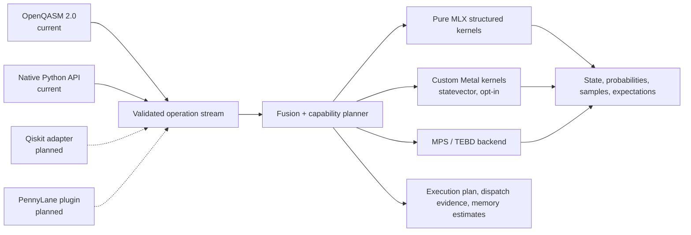

<div align="center">
  
  <h1>Qupertino</h1>
  <p><strong>Fast, inspectable local quantum-circuit simulation for Apple Silicon.</strong></p>
  <p>Pure MLX execution, hand-tuned Metal kernels, statevector and MPS backends, strict OpenQASM, reproducible benchmarks, and a desktop studio.</p>
  <p>
    <a href="https://github.com/MonitSharma/Qupertino/actions/workflows/ci.yml"></a>
    
    
    
    <a href="LICENSE"></a>
  </p>
  <p>
    <a href="#quick-start">Quick start</a> ·
    <a href="#performance">Performance</a> ·
    <a href="#trust-correctness-and-observability">Trust &amp; correctness</a> ·
    <a href="#sdk-integration-status">SDK status</a> ·
    <a href="#reproducing-the-results">Reproduce</a>
  </p>
</div>


> **Project goal:** build the fastest trustworthy local quantum-simulation
> engine for Apple Silicon, with adapters that let Qiskit, PennyLane, and other
> quantum SDK users transparently benefit from Apple GPUs.

Qupertino is already a capable local simulator and benchmark stack. The native
Qiskit and PennyLane device integrations are the next product layer; they are
listed honestly as planned rather than presented as finished adapters.

## At a glance

| Area | Current capability |
| --- | --- |
| Accelerated engine | MLX on Apple Silicon, plus opt-in hand-written Metal kernels |
| Simulation backends | Exact statevector (`sv`) and matrix-product state (`mps`) |
| Circuit inputs | Native Python operation dictionaries and strict unitary OpenQASM 2.0 |
| Workloads | QFT, phase estimation, Grover, QAOA, VQE, QCBM, QNN, random circuits, and spin dynamics |
| Trust model | Capability-gated dispatch, explicit execution plans, numerical parity tests, synchronized benchmarks, and safe fallbacks |
| Current test suite | **292 tests** across the simulator, algorithms, MPS, QASM, Metal dispatch, and QuantumStudio backend |
| Desktop product | QuantumStudio orchestration, monitoring, plotting, and export |
| SDK adapters | Native Qiskit backend and PennyLane device plugin are planned; `mlxq.qml` is currently an internal PennyLane-like wrapper |

## Project lineage

This repository is a private development fork of the original public Qupertino
project. The fork is maintained independently and does not open pull requests
against upstream.

| | Repository |
| --- | --- |
| **Private fork** | [MonitSharma/Qupertino](https://github.com/MonitSharma/Qupertino) |
| **Original upstream** | [BoltzmannEntropy/Qupertino](https://github.com/BoltzmannEntropy/Qupertino) |
| **Original website** | [QupertinoWEB](https://boltzmannentropy.github.io/QupertinoWEB/) |
| **Original author** | Shlomo Kashani |
| **Benchmark baseline** | Upstream commit `2b99d30` |
| **Measured fork revision** | Fork commit `a73436e` |

Original authorship, licensing, and citation information are retained at the
end of this README.

## Quick start

### Requirements

- Apple Silicon Mac (M1, M2, M3, or M4 family)
- macOS 13.3 or newer recommended
- Python 3.9 or newer
- Xcode command-line tools recommended for development and profiling

### Install

```bash
git clone git@github.com:MonitSharma/Qupertino.git
cd Qupertino

python3 -m venv .venv
source .venv/bin/activate
python -m pip install --upgrade pip
python -m pip install -e '.[plot,tests,backend]'
```

### Run a first accelerated circuit

```bash
MLXQ_METAL_KERNELS=auto PYTHONPATH=src .venv/bin/python - <<'PY'
from mlxq import Device, metal_runtime_status

operations = [
    {"name": "H", "wires": [0]},
    {"name": "CNOT", "wires": [0, 1]},
    {"name": "CNOT", "wires": [1, 2]},
]

device = Device(3)
device.execute(operations, report=True)
device.synchronize()

print("probabilities:", device.sim.probabilities())
print("Metal status:", metal_runtime_status(3)["reason"])
print("execution plan:", device.last_execution_plan)
PY
```

`MLXQ_METAL_KERNELS=auto` requests custom kernels only when the runtime proves
that the platform, GPU device, dtype, backend, indexing, and memory constraints
are compatible. The unset default remains off; unsupported configurations fall
back safely.

### Verify the checkout

```bash
./test.sh
./bench.sh --circuit ghz --simulate-limit 12 \
  --qubits 2,5,8,10,12 --warmups 1 --repeats 2 --no-save-plots
```

## How execution works



The pure-MLX tier specializes common gate classes using array operations. The
Metal tier recognizes compatible layer structure and dispatches custom kernels
for phase/ZZ layers, affine permutations, uniform and per-wire single-qubit
layers, QFT stages, and XX/YY evolution. Both tiers consume the same validated
operation stream.

## Performance

### Current fork: Apple M3 Pro, 25 qubits

The 2026-07-14 fork campaign ran 29 workloads with one warmup per arm and five
paired repeats, alternating pure MLX and custom Metal inside every repeat. The
environment used Python 3.13.2 and MLX 0.32.0 at fork commit `a73436e`.

- Median Metal speedup over pure MLX: **10.19×**
- Workloads at or above 1.1×: **26 of 29**
- Workloads at or above 10×: **19 of 29**
- Maximum: **32.30×** on long-range Ising
- Near parity: amplitude estimation, W state, and ladder Heisenberg

| Representative workload | Pure MLX | Custom Metal | Speedup |
| --- | ---: | ---: | ---: |
| Long-range Ising | 16,440.5 ms | **509.1 ms** | **32.30×** |
| Grover | 2,611.6 ms | **118.3 ms** | **22.08×** |
| EfficientSU2 | 4,845.9 ms | **263.4 ms** | **18.44×** |
| TFIM Trotter, second order | 20,674.7 ms | **1,269.4 ms** | **16.29×** |
| GHZ | 391.3 ms | **25.3 ms** | **15.47×** |
| QFT | 1,742.2 ms | **136.6 ms** | **12.76×** |
| QAOA | 3,850.2 ms | **375.1 ms** | **10.28×** |
| VQE plus energy evaluation | 4,236.5 ms | **1,122.5 ms** | **3.77×** |

<div align="center">
  
  <br/><em>Paired pure-MLX divided by Metal wall time at 25 qubits; larger is better.</em>
</div>

<details>
<summary><strong>Show absolute M3 Pro runtimes</strong></summary>

<div align="center">
  
  <br/><em>Mean synchronized wall time on a log scale; lower is better.</em>
</div>

</details>

### Original upstream versus this fork

The original committed 29-workload chart was measured on an M1 Max. The fork
rerun used an M3 Pro. The comparison below is therefore useful for seeing how
the **relative pure-MLX/Metal speedup changes by workload**, but it is not a
controlled test of absolute version performance.

With a ±0.25× band, the fork rerun has 17 higher ratios, five effectively
unchanged ratios, and seven lower ratios.

<div align="center">
  
  <br/><em>Original published M1 Max ratio → private-fork M3 Pro ratio. Positive does not imply lower cross-machine wall time.</em>
</div>

<details>
<summary><strong>Show the complete 29-workload comparison table</strong></summary>

| Workload | Original upstream, M1 Max | Private fork, M3 Pro | Ratio difference |
| --- | ---: | ---: | ---: |
| Long-range Ising | 24.3× | 32.30× | +8.00× |
| Grover | 11.5× | 22.08× | +10.58× |
| EfficientSU2 | 10.6× | 18.44× | +7.84× |
| TFIM Trotter (2nd) | 25.0× | 16.29× | -8.71× |
| Variational | 14.3× | 16.24× | +1.94× |
| QCBM | 12.0× | 16.13× | +4.13× |
| GHZ | 9.1× | 15.47× | +6.37× |
| QFT (entangled) | 7.3× | 13.46× | +6.16× |
| cuQuantum proxy | 13.2× | 13.05× | -0.15× |
| QFT | 8.4× | 12.76× | +4.36× |
| Quantum walk (V-chain) | 11.6× | 11.56× | -0.04× |
| Phase estimation | 8.0× | 10.80× | +2.80× |
| Graph state | 8.9× | 10.38× | +1.48× |
| QAOA | 8.4× | 10.28× | +1.88× |
| RealAmplitudes | 5.1× | 10.19× | +5.09× |
| Heisenberg XXZ | 13.2× | 10.18× | -3.02× |
| Heisenberg | 13.8× | 10.15× | -3.65× |
| Quantum walk | 11.4× | 10.08× | -1.32× |
| Phase estimation (inexact) | 8.8× | 10.01× | +1.21× |
| QNN | 7.4× | 9.97× | +2.57× |
| Random circuit | 4.7× | 9.16× | +4.46× |
| Deutsch-Jozsa | 8.4× | 8.72× | +0.32× |
| TFIM Trotter (1st) | 12.3× | 8.70× | -3.60× |
| TFIM random field | 13.1× | 8.48× | -4.62× |
| Heisenberg random field | 8.9× | 7.76× | -1.14× |
| VQE plus energy evaluation | 1.3× | 3.77× | +2.47× |
| Heisenberg ladder | 1.0× | 1.03× | +0.03× |
| W state | 1.0× | 1.00× | +0.00× |
| Amplitude estimation | 1.0× | 0.99× | -0.01× |

</details>

### Controlled same-machine revision check

To isolate code changes, the same M3 Pro ran upstream commit `2b99d30` and fork
commit `a73436e` at 20 qubits with one warmup and seven paired repeats. Pure-MLX
medians were broadly stable, while Metal latency increased on all six sampled
workloads:

| Workload | Upstream Metal | Fork Metal | Fork change | Upstream → fork speedup |
| --- | ---: | ---: | ---: | ---: |
| QFT | 4.326 ms | 4.544 ms | +5.0% slower | 5.86× → 5.62× |
| QAOA | 8.902 ms | 9.625 ms | +8.1% slower | 8.86× → 8.21× |
| TFIM Trotter (2nd) | 26.355 ms | 33.028 ms | +25.3% slower | 9.02× → 7.33× |
| Phase estimation | 6.286 ms | 7.031 ms | +11.8% slower | 5.71× → 5.11× |
| Grover | 4.815 ms | 5.367 ms | +11.5% slower | 12.69× → 11.29× |
| GHZ | 1.628 ms | 2.293 ms | +40.8% slower | 5.96× → 4.06× |

The correctness and observability work is valuable, but it did not improve raw
Metal latency yet. One measured contributor is repeated runtime capability
probing: about 0.21 ms per check. Temporarily caching the static portion saved
0.47–5.00 ms (8–19%) in focused measurements. Caching immutable hardware facts
while preserving per-run policy checks is the next measured optimization.

<details>
<summary><strong>Show the original upstream four-backend M1 Max result</strong></summary>

The original project reported an interleaved M1 Max campaign against Qiskit Aer
CPU and PennyLane `lightning.qubit`. Its unpublished `paper/` evidence tree is
not distributed in this checkout, so this is retained as a historical upstream
claim rather than a newly reproduced four-backend result.

<div align="center">
  
</div>

| Workload @ 25q | Qupertino Metal | Qupertino MLX | Aer CPU | PennyLane lightning |
| --- | ---: | ---: | ---: | ---: |
| QFT | **0.059 s** | 0.72 s | 2.80 s | 5.61 s |
| Ring-QAOA, 6 layers | **0.150 s** | 2.07 s | 5.35 s | 6.84 s |
| TFIM Trotter, 20 steps | **0.495 s** | 5.82 s | 17.79 s | 32.95 s |
| Phase estimation | **0.105 s** | 0.91 s | 4.05 s | 6.06 s |
| Grover proxy | **0.052 s** | 1.11 s | 1.21 s | 2.73 s |
| GHZ | **0.022 s** | 0.27 s | 0.69 s | 0.42 s |

</details>

## Trust, correctness, and observability

Fast simulation is useful only when dispatch, semantics, and measurements are
auditable. This fork adds explicit evidence at each layer:

- **Safe Metal selection:** platform, device, API, dtype, backend, qubit-index,
  memory, and ablation-policy checks must all pass.
- **Inspectable plans:** `Device.explain()` reports recognized patterns,
  selected kernels, fallbacks, expected dispatches, and memory estimates without
  executing the circuit.
- **Synchronized proof:** `execute(..., report=True)` plus `synchronize()`
  records concrete host dispatches and completes pending MLX work.
- **Numerical parity:** custom kernels are tested against pure MLX, including
  all-distinct-angle and long-product stress cases.
- **Strict QASM:** unsupported dynamic semantics are rejected with source-aware
  errors instead of being silently ignored.
- **Hermetic tests:** generated files use temporary directories, and successful
  tests leave the checkout unchanged.

### Test inventory

| Category | Tests |
| --- | ---: |
| Core simulator and gate algebra | 149 |
| Quantum-computing examples and algorithms | 41 |
| Internal consistency and measurement parity | 21 |
| MPS backend and correctness | 16 |
| QML wrapper, QFT, and subset semantics | 10 |
| Strict OpenQASM and silent-risk checks | 7 |
| QPE energy estimation | 2 |
| Benchmark protocol and plotting | 4 |
| Custom Metal parity and dispatch | 19 |
| Execution plans and capability reporting | 5 |
| QuantumStudio backend and MCP API | 18 |
| **Total** | **292** |

Run everything with:

```bash
./test.sh
```

CI runs portable backend checks on hosted Linux. Full simulator and custom-Metal
validation is available as a manually triggered job for a self-hosted Apple
Silicon runner labeled `macOS` and `ARM64`.

### Known limits

- Custom Metal kernels currently accelerate the exact statevector backend, not
  the MPS backend.
- The bundled strict importer accepts 33 of 42 OpenQASM files. It rejects reset,
  classical control, mid-circuit measurement, opaque gates, arbitrary includes,
  and malformed declarations.
- Native Qiskit and PennyLane plugin interfaces are not complete yet.
- The runtime capability probe currently adds measurable host overhead and is
  the next performance optimization target.
- Cross-machine charts compare relative speedup only; absolute performance
  claims require the same machine and benchmark protocol.

## SDK integration status

| Integration | Status | Intended experience |
| --- | --- | --- |
| Native `mlxq` Python operations | Available | Execute validated operation dictionaries directly |
| OpenQASM 2.0 | Available, strict unitary subset | Import supported circuits with explicit rejection of dynamic semantics |
| `mlxq.qml` | Available, internal wrapper | PennyLane-like tapes, measurements, templates, and parameter-shift gradients |
| Qiskit backend | Planned | Select Qupertino as a local backend without rewriting the circuit |
| PennyLane device plugin | Planned | Use a Qupertino device from a normal QNode |
| Other SDKs | Planned after canonical adapter layer | Normalize SDK circuits once, then reuse the same planner and execution evidence |

The integration design target is a small, tested canonical operation layer.
SDK adapters should translate circuit semantics, preserve wire order and
parameters, surface unsupported operations explicitly, and return native SDK
result objects without bypassing Qupertino's capability and correctness checks.

## Running benchmarks

### Reproducible single workload

```bash
MLXQ_METAL_KERNELS=1 ./bench.sh \
  --circuit qft --qubits 15,20,25 --warmups 1 --repeats 5
```

### Full orchestrated run

```bash
./bench_with_logging.sh
```

### Statevector or MPS backend

```bash
./bench.sh --circuit qaoa --backend sv  --qubits 8,12,16 --repro
./bench.sh --circuit qaoa --backend mps --qubits 8,12,16 --repro \
  --mps-dmax 64 --mps-eps 1e-10
```

### OpenQASM suite

```bash
./bench.sh --qasm-suite --qasm-max-qubits 18 --qasm-timeout-ms 30000
```

### Apple GPU inspection

```bash
PYTHONPATH=src .venv/bin/python tools/profile_apple_gpu.py \
  --qubits 20 --repeats 7 --output /tmp/qupertino-profile.json
```

The profiler records synchronized cold/warm timing, allocator memory, estimated
state traffic, full-state CPU readback, dispatch evidence, and pure-MLX parity.
Use the paired benchmark sweep—not a profiler run—for publication claims.

### Benchmark families

| Category | Circuit keys |
| --- | --- |
| Spin and Hamiltonian dynamics | `hamiltonian_simulation`, `time_evolution`, `trotter`, `steady_state`, `heisenberg`, `heisenberg_xxz`, `heisenberg_random_field`, `tfim`, `tfim_trotter2`, `tfim_random_field`, `long_range_ising`, `ladder_heisenberg` |
| Variational and QML | `qcbm`, `qaoa`, `vqe`, `variational_circuit` |
| Algorithms and circuits | `qft`, `phase_estimation`, `grover`, `ghz`, `random_circuit` |

Run any family with `./bench.sh --circuit <key>`. Use `./bench.sh --help` for
qubit schedules, caps, MPS controls, QASM options, and reproducibility settings.

## Reproducing the results

The complete 2026-07-14 evidence bundle is tracked under
[`assets/benchmarks-frozen/fork-m3pro-20260714/`](assets/benchmarks-frozen/fork-m3pro-20260714/):

- 145 paired raw timing rows
- 29-workload summary CSV
- run manifest
- transcribed historical ratios with source attribution
- historical/current comparison CSV and JSON summary
- controlled same-machine upstream/fork CSV

Recreate the current sweep and comparison:

```bash
PYTHONPATH=src .venv/bin/python tools/shader_suite_sweep.py \
  --outdir bench/runs/shader_sweep_current --qubits 25 --repeats 5

PYTHONPATH=src .venv/bin/python tools/compare_shader_sweeps.py \
  --historical assets/benchmarks-frozen/fork-m3pro-20260714/historical_chart_ratios.csv \
  --current bench/runs/shader_sweep_current/shader_sweep_summary.csv \
  --outdir bench/runs/shader_sweep_current \
  --historical-label "published M1 Max chart" \
  --current-label "M3 Pro rerun"
```

Transient runs belong under `bench/runs/`. Promote only reviewed evidence to
`assets/benchmarks-frozen/`; keep historical sample bundles immutable.

## QuantumStudio

QuantumStudio is the desktop companion for launching runs, monitoring progress,
viewing results, and exporting artifacts.

```bash
cd quantumstudio
./bin/appctl up
./bin/appctl status
./bin/appctl logs backend
./bin/appctl down
```

Build local UI artifacts with:

```bash
./scripts/build_flutter_app.sh --release
./scripts/build_dmg.sh
```

<details>
<summary><strong>Show the QuantumStudio gallery</strong></summary>


</details>

## Repository map

| Path | Purpose |
| --- | --- |
| `src/mlxq/` | Simulator, gates, statevector, MPS, QASM, QML wrapper, execution plans, and Metal shaders |
| `src/tests/` | Simulator, algorithm, correctness, protocol, and Metal tests |
| `tools/` | GPU profiler, sweep runner, comparison plots, and supporting utilities |
| `bench.sh` | Main benchmark launcher |
| `bench_with_logging.sh` | Orchestrated benchmark and promotion workflow |
| `bench/runs/` | Ignored transient run output |
| `assets/benchmarks-frozen/` | Reviewed evidence and immutable sample bundles |
| `assets/perf-charts/` | README-ready performance figures |
| `datasets/qasm/local/` | Bundled OpenQASM corpus |
| `quantumstudio/` | Desktop UI, backend API, MCP server, and packaging scripts |
| `.github/workflows/ci.yml` | Portable CI and manually triggered Apple Silicon validation |

## Development

```bash
# All tests
./test.sh

# Simulator only
python -m pytest src/tests -q

# QuantumStudio backend only
python -m pytest quantumstudio/tests -q

# One targeted module
./test.sh -- src/tests/mlxQMetalKernelsTest.py
```

Ordinary tests and generated plots use temporary directories. A successful full
test run should leave `git status --short` unchanged.

## Citation

The original project citation remains:

```bibtex
@software{kashani_qupertino_2026,
  author       = {Shlomo Kashani},
  title        = {Qupertino / QuantumStudio: Apple Silicon Quantum Benchmarking Stack},
  year         = {2026},
  url          = {https://github.com/BoltzmannEntropy/Qupertino},
  note         = {GitHub repository}
}
```

The associated technical report is self-published but unpublished; its PDF and
LaTeX source are not distributed in this repository.

## License

Qupertino / QuantumStudio is free and open source under the [MIT License](LICENSE).
The source and compiled macOS binaries may be used, modified, and redistributed,
including commercially, under the license terms.
