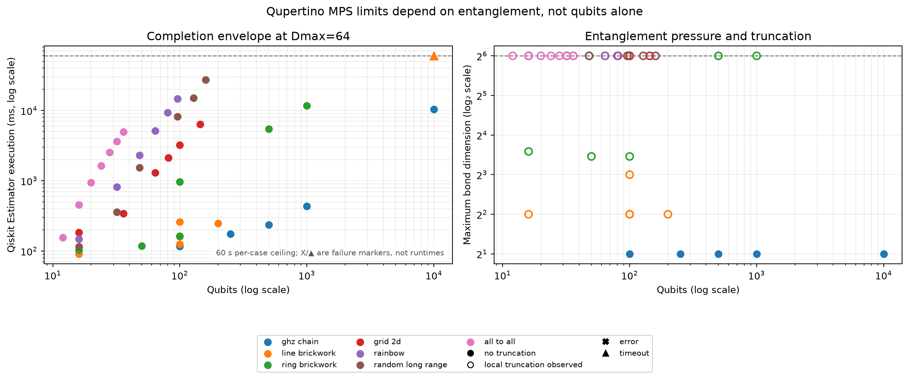
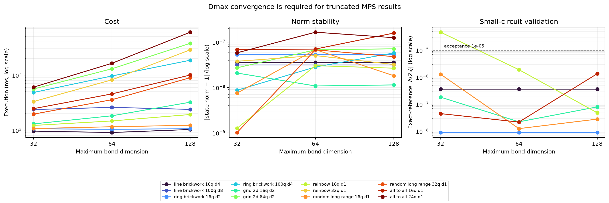
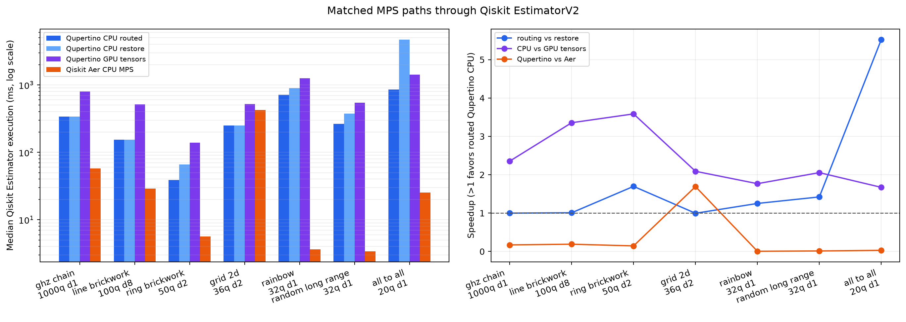

# Step 8: reliable, routed MPS and matched Aer evidence

This bundle freezes the reliability and performance campaign for Qupertino's
native Qiskit `QupertinoEstimatorV2` MPS path. It is evidence for one Apple M3
Pro (36 GB), engine commit `0691674`, Python 3.13.2, MLX 0.32.0, Qiskit 2.5.0,
and Qiskit Aer 0.17.2. Every manifest records a clean engine checkout and every
timed case ran in a fresh child process.

## What changed since Step 7

- MLX's process-aborting `sgesvdx` path was replaced by a catchable, scaled CPU
  SVD ladder: SciPy `gesdd`, SciPy `gesvd`, NumPy complex64, then NumPy
  complex128. Failed attempts and the successful driver are reported.
- Every two-site split preserves relative discarded-weight telemetry and
  renormalizes the retained spectrum. The engine tracks a mixed-canonical
  center and exposes explicit `canonicalize()` and `renormalize()` operations.
- A whole-circuit routing preflight selects persistent lookahead routing only
  when it predicts no more swaps than restore-after-each-gate routing. Local
  circuits bypass the quadratic preflight.
- Qiskit and PennyLane expose report/warn/error accuracy policies and optional
  automated `Dmax` convergence reports.
- The CPU SVD path uses single-precision SciPy `gesdd` first with in-place LAPACK
  input reuse. GPU tensors were remeasured only after the reliable CPU path and
  routing work were complete.

## Reliability result

The standard 26-case `Dmax=64` campaign completed all cases with no numerical
errors. Its maximum exact-reference error through 20 qubits was `1.890e-6`,
down from `1.278e-2` in Step 7 (a 6,762-fold reduction in the worst observed
error). The 16-case boundary campaign completed 15 cases with one 60-second
timeout and no process errors.

| Step 7 case | Historical result | Step 8 result |
| --- | --- | --- |
| Ring brickwork, 500q d4 | Process-aborting SVD failure | Completed in 5.432 s |
| 2D grid, 144q d2 | Process-aborting SVD failure | Completed in 6.410 s |
| Rainbow, 96q d1 | Process-aborting SVD failure | Completed in 14.627 s |
| Random long range, 160q d1 | Process-aborting SVD failure | Completed in 27.482 s |
| All to all, 32q d1 | 20.969 s, norm 0.5730 | 3.637 s, norm 1.00000024 |
| All to all, 36q d1 | Timed out after 30 s | Completed in 4.935 s |

Renormalization prevents discarded local weight from appearing as a collapsing
state norm; it does **not** turn a truncated MPS into an exact state. The
accuracy classification and `Dmax` convergence report remain the trust signals.
The boundary cases for grid, rainbow, and random-long-range schedules exceed
the default local discarded-weight threshold even though their normalized
states complete successfully.

## Current completion envelope

The completion campaigns use CPU MPS, `Dmax=64`, `eps=1e-10`, topology-aware
routing, and a 60-second per-case ceiling.

| Entanglement family | Largest demonstrated completion | Runtime | Trust signal |
| --- | ---: | ---: | --- |
| GHZ chain | 10,000q d1 | 10.393 s | Bond 2; no local truncation |
| 1D brickwork | 200q d4 | 0.246 s | Bond 4; 10,000q d8 reached the 60 s ceiling |
| Ring brickwork | 1,000q d4 | 11.693 s | Bond cap; within configured local thresholds |
| 2D grid | 144q d2 | 6.410 s | Bond cap; local threshold exceeded |
| Rainbow | 96q d1 | 14.627 s | Bond cap; local threshold exceeded |
| Random long range | 160q d1 | 27.482 s | Bond cap; local threshold exceeded |
| All to all | 36q d1 | 4.935 s | Bond cap; within configured local thresholds |

## Dmax convergence

All 24 representative `Dmax=32` and `Dmax=128` runs completed. Combined with
the matching `Dmax=64` standard rows, the sweep shows the expected tradeoff:
local high-entanglement cases become more accurate as bond capacity grows, but
their CPU cost can rise by an order of magnitude. The worst small exact error
was `4.619e-5` at `Dmax=32`, `1.890e-6` at 64, and `1.341e-6` at 128.

The SDK convergence report compares the returned analytic result at successive
bond dimensions and records each run's accuracy telemetry. Successive agreement
is convergence evidence, not an independent exactness proof.

## Matched Qupertino versus Qiskit Aer MPS

The matched campaign was deliberately run last. All four paths receive the same
Qiskit circuit and analytic `Z0` EstimatorV2 contract: Qupertino CPU with
lookahead routing, Qupertino CPU with restore routing, Qupertino GPU tensors
with lookahead routing, and Qiskit Aer CPU MPS. Each case uses one warmup, three
measured repetitions, rotating implementation order, and a fresh process.

| Circuit | QP CPU routed | QP CPU restore | QP GPU tensors | Aer CPU MPS | Routing gain | QP / Aer speedup |
| --- | ---: | ---: | ---: | ---: | ---: | ---: |
| GHZ 1,000q d1 | 338.76 ms | 338.28 ms | 797.22 ms | **57.90 ms** | 1.00x | 0.17x |
| Line 100q d8 | 153.25 ms | 154.50 ms | 514.20 ms | **29.00 ms** | 1.01x | 0.19x |
| Ring 50q d2 | 38.77 ms | 65.78 ms | 139.01 ms | **5.62 ms** | 1.70x | 0.14x |
| Grid 36q d2 | **249.91 ms** | 248.75 ms | 522.18 ms | 422.57 ms | 1.00x | **1.69x** |
| Rainbow 32q d1 | 710.44 ms | 888.97 ms | 1,255.08 ms | **3.65 ms** | 1.25x | 0.005x |
| Random long range 32q d1 | 264.76 ms | 376.30 ms | 544.00 ms | **3.40 ms** | 1.42x | 0.013x |
| All to all 20q d1 | 851.13 ms | 4,700.62 ms | 1,422.03 ms | **25.17 ms** | 5.52x | 0.030x |

The result is intentionally not marketed as a blanket win: Aer is faster on
six of seven schedules, while Qupertino is 1.69x faster on the 36-qubit grid
case. Lookahead routing materially helps the nonlocal Qupertino schedules,
reducing all-to-all swaps from 2,280 to 384, but cannot erase the current CPU
SVD and Python/MLX orchestration gap. CPU beats GPU tensors on all seven cases,
so automatic MPS correctly remains on CPU. Native GPU MPS acceleration should
not become the default until a future matched campaign proves a crossover.

## Files

- `matched_aer_*`: raw rows, summary CSV/JSON, clean-engine manifest, and chart
  for the matched four-path campaign.
- `standard_d64_*` and `boundaries_d64_*`: raw rows, summaries, and clean-engine
  manifests for the current completion envelope.
- `convergence_d32_*`, `standard_d64_*`, and `convergence_d128_*`: representative
  convergence inputs.
- `mps_limit_combined.csv` and `mps_convergence_combined.csv`: plotted source
  rows.

The complete commands and case lists are preserved in each manifest. Transient
runs remain under `bench/runs/`; this directory contains only the reviewed
evidence promoted into version control.
