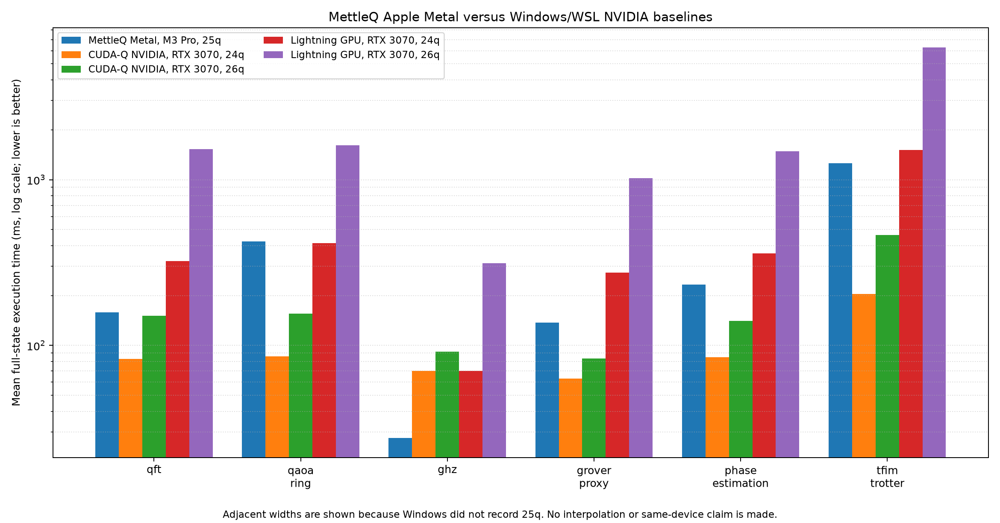

# Windows/WSL NVIDIA baseline

This folder preserves the benchmark scripts and measurements added by commit
`ca9a1f5` on the `windows-wsl-baseline` branch. It was imported into MettleQ
`main` as a folder-only change so the newer Apple engine, documentation,
packaging, and release safeguards on `main` remain authoritative.

## Recorded environment

The campaign ran under WSL2 Ubuntu on Windows with an NVIDIA RTX 3070 8 GB.
The manifests record Linux
`6.18.33.2-microsoft-standard-WSL2`, x86-64, Python 3.11.13, PennyLane 0.45.1,
PennyLane Lightning 0.45.0, and NumPy 2.4.6. The CUDA-Q, Qiskit, Aer, NVIDIA
driver, and CUDA versions were not captured in the existing manifests. Neither
were the Windows CPU model, system RAM, power mode, or thermal state. Future
runs should record all of them before making device-level efficiency claims.

The Apple comparison uses the frozen MettleQ campaign on a 14-inch MacBook Pro
with an M3 Pro, 12 CPU cores, 18 integrated GPU cores, and 36 GB unified memory.
That campaign used macOS 26.5.2, Python 3.13.2, MLX 0.32.0, one warmup, and ten
paired measured repeats at 25 qubits.

## Workloads and timing contract

The six families are gate-matched across the Windows framework scripts and the
MettleQ workload implementation:

| Workload | Circuit contract |
| --- | --- |
| `qft` | Explicit H/controlled-phase ladder without final swaps |
| `qaoa_ring` | Six ring layers with the same gamma and beta schedule |
| `ghz` | One Hadamard followed by a nearest-neighbor CNOT chain |
| `grover_proxy` | Uniform initialization and one CZ-chain diffusion proxy |
| `phase_estimation` | Base phase 0.4 followed by the same inverse-QFT ladder |
| `tfim_trotter` | 20 open-boundary ZZ/RX Trotter steps |

CUDA-Q, PennyLane, and Aer statevector request a complete final state. Each
Windows cell has one warmup and three measured runs and reports the arithmetic
mean. Framework construction and transpilation are outside the Aer timing;
QNode/kernel execution and state materialization are inside the timed region.

## What the measurements say

The Windows GPU hierarchy is clear at larger widths. CUDA-Q NVIDIA is the
strongest general dense-state backend in five of six families. Lightning GPU
substantially outscales Lightning CPU and `default.qubit`, but remains behind
CUDA-Q NVIDIA on these runs. GHZ is the exception: fixed CUDA-Q launch/setup
cost remains visible on a very shallow circuit.

Against those results, the adjacent-width Apple comparison is:

| Workload | MettleQ Metal M3 Pro, 25q | CUDA-Q NVIDIA RTX 3070, 24q / 26q | Lightning GPU RTX 3070, 24q / 26q |
| --- | ---: | ---: | ---: |
| QFT | **158.20 ms** | 82.93 / 150.64 ms | 323.40 / 1,529.23 ms |
| Ring QAOA | **424.51 ms** | 85.68 / 155.19 ms | 413.74 / 1,611.73 ms |
| GHZ | **27.67 ms** | 70.08 / 91.78 ms | 70.15 / 312.64 ms |
| Grover proxy | **137.03 ms** | 63.17 / 83.31 ms | 275.62 / 1,018.28 ms |
| Phase estimation | **233.37 ms** | 84.99 / 140.96 ms | 360.20 / 1,481.04 ms |
| TFIM Trotter | **1,257.13 ms** | 204.35 / 463.70 ms | 1,513.36 / 6,300.58 ms |

MettleQ 25q beats the Windows Aer CPU 24q result by 1.63–8.36× across all six
families and the Windows Lightning CPU 24q result by 9.42–19.22×. Against
Lightning GPU, MettleQ is faster than five of six 24q rows and every 26q row.
CUDA-Q NVIDIA wins five dense, interaction-heavy families; MettleQ wins GHZ by
2.53× versus CUDA-Q's 24q row while simulating one more qubit.

These are not same-hardware or same-width speedup claims. Windows did not record
25q, so the report shows the actual 24q and 26q measurements around MettleQ's
25q point. It does not interpolate between them.



The machine-readable comparison is
[`results/mettleq_windows_adjacent_widths.csv`](results/mettleq_windows_adjacent_widths.csv).

## MPS contract warning

The historical Aer MPS script calls `save_statevector()` at 25 qubits and
below, but calls `measure_all()` with one shot above 25 qubits. Consequently,
the 24q rows include full-state materialization while the 26–40q rows return a
single sampled count. The dramatic runtime discontinuity is caused by this
contract switch.

The raw files are retained unchanged for provenance, but the MPS points must be
split into two experiments. A future rerun should use one result contract at
every width—preferably fixed-shot sampling or a fixed local expectation for
large MPS—and validate accuracy or sampling agreement separately.

## Reproduce the comparison artifact

From the repository root on macOS with the plotting extra installed:

```bash
python -m pip install -e '.[plot]'
python windows_baseline/analyze_comparison.py
```

To rerun the Windows frameworks, create separate pinned environments for
CUDA-Q, Qiskit Aer, and PennyLane Lightning GPU, then invoke their scripts with
the same qubits, workloads, warmups, and repeats. Do not aggregate a failed
backend run with stale CSV files from an older campaign; start from an empty
results directory and archive the environment manifest with the output.

The original all-backend tables are in [`results_summary.md`](results_summary.md),
and every raw run, summary, and available manifest is in [`results/`](results/).
