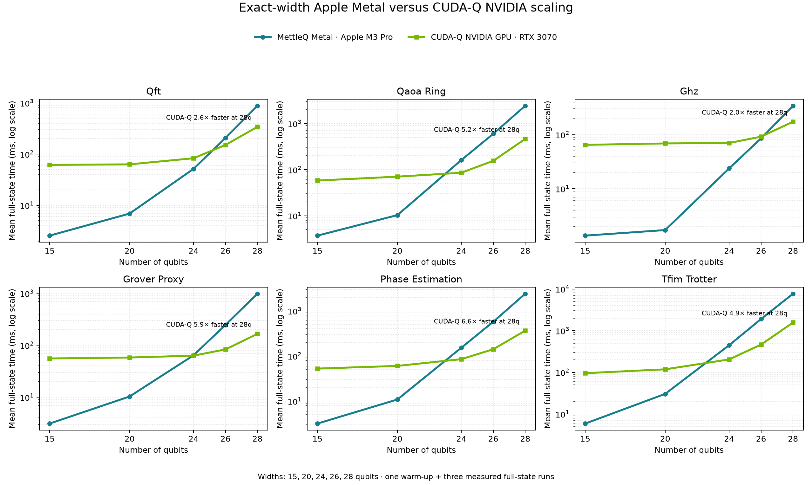

# Windows/WSL NVIDIA baseline

This folder preserves the benchmark scripts and measurements added by commit
`ca9a1f5` on `windows-wsl-baseline`. Only this evidence folder was imported;
the maintained source, packaging, and documentation remain those from `main`.

## Systems and measurement contract

The Windows campaign ran in WSL2 Ubuntu on an NVIDIA RTX 3070 8 GB with
Python 3.11.13. Its manifests capture PennyLane 0.45.1, Lightning 0.45.0,
NumPy 2.4.6, and Linux `6.18.33.2-microsoft-standard-WSL2`. They do not capture
the Windows CPU, RAM, CUDA-Q/Qiskit/Aer versions, NVIDIA driver, CUDA version,
power mode, or thermal state, so this is framework evidence—not a controlled
device-efficiency comparison.

The matched Apple campaign ran on a 14-inch MacBook Pro with an M3 Pro
(12 CPU cores, 18 GPU cores), 36 GB unified memory, macOS 26.5.2, Python
3.13.2, MLX 0.32.0, and MettleQ commit `ef0b6b9`. Each workload ran in a fresh
process so a 28-qubit MLX allocation could not contaminate the next workload's
memory gate. The preflight required the two-state lower bound plus 6 GiB of
available reserve; every 28-qubit cell passed.

Both campaigns use the same six circuit families at 15, 20, 24, 26, and 28
qubits, one warm-up, three measured repetitions, and a complete final-state
result:

| Workload | Circuit contract |
| --- | --- |
| `qft` | Explicit H/controlled-phase ladder without final swaps |
| `qaoa_ring` | Six ring layers with identical gamma/beta schedule |
| `ghz` | Hadamard followed by a nearest-neighbor CNOT chain |
| `grover_proxy` | Uniform initialization and one CZ-chain diffusion proxy |
| `phase_estimation` | Base phase 0.4 and the same inverse-QFT ladder |
| `tfim_trotter` | 20 open-boundary ZZ/RX Trotter steps |

MettleQ additionally checks norm at every width and compares the complete state
against Qiskit `Statevector` through 20 qubits after global-phase alignment.
Every accuracy check passed the `5e-6` threshold; the largest recorded checked
amplitude error is below it. TFIM's 28-qubit norm is 0.9999736 after 20
complex64 steps.

## Matched-width result

`CUDA-Q / MettleQ` above 1× means MettleQ is faster; below 1× means CUDA-Q is
faster:

| Workload | 15q | 20q | 24q | 26q | 28q |
| --- | ---: | ---: | ---: | ---: | ---: |
| QFT | **24.06×** | **9.15×** | **1.61×** | 0.73× | 0.39× |
| Ring QAOA | **15.67×** | **6.83×** | 0.53× | 0.26× | 0.19× |
| GHZ | **47.70×** | **39.98×** | **2.95×** | **1.07×** | 0.51× |
| Grover proxy | **17.89×** | **5.62×** | 0.99× | 0.34× | 0.17× |
| Phase estimation | **16.49×** | **5.54×** | 0.56× | 0.25× | 0.15× |
| TFIM Trotter | **16.15×** | **3.88×** | 0.46× | 0.24× | 0.20× |

The 28-qubit absolute endpoint is:

| Workload | MettleQ M3 Pro Metal | CUDA-Q RTX 3070 | Lightning GPU RTX 3070 | Aer CPU WSL | Lightning CPU WSL |
| --- | ---: | ---: | ---: | ---: | ---: |
| QFT | **877.90 ms** | 340.38 | 6,635.45 | 13,860.52 | 63,080.18 |
| Ring QAOA | **2,428.86 ms** | 463.80 | 7,254.50 | 17,438.65 | 72,095.43 |
| GHZ | **341.94 ms** | 173.24 | 1,141.82 | 3,332.40 | 6,389.85 |
| Grover proxy | **982.80 ms** | 165.94 | 4,350.20 | 3,001.91 | 45,135.60 |
| Phase estimation | **2,391.85 ms** | 363.80 | 6,881.60 | 16,894.65 | 70,061.67 |
| TFIM Trotter | **7,695.88 ms** | 1,565.92 | 27,163.63 | 54,528.06 | 276,929.24 |

At 28 qubits MettleQ is 3.05–15.79× faster than Aer CPU, 18.69–71.85× faster
than Lightning CPU, and 2.88–7.56× faster than Lightning GPU. CUDA-Q NVIDIA is
1.97–6.57× faster at that width. At smaller widths, fixed NVIDIA launch cost is
visible: MettleQ wins all six CUDA-Q rows at 15 and 20 qubits, plus QFT and GHZ
at 24 qubits and GHZ at 26 qubits.



The all-backend scaling figure remains available at
[`plots/mettleq_vs_windows_matched_widths.png`](plots/mettleq_vs_windows_matched_widths.png).

The long-form, machine-readable table is
[`results/mettleq_windows_matched_widths.csv`](results/mettleq_windows_matched_widths.csv).
Raw Apple results and manifests are frozen under
[`assets/benchmarks-frozen/fork-m3pro-20260719-cudaq-competitive-metal/`](../assets/benchmarks-frozen/fork-m3pro-20260719-cudaq-competitive-metal/).

## Metal changes measured here

- All-qubit RX uses radix-16 traversal: four adjacent qubits per pass instead
  of two. Isolated RX improved 3.07× at 20q, 1.93× at 24q, and 1.65× at 26q.
- Chain/ring CPHASE or ZZ plus the next RX layer execute in one Metal pass.
  Versus radix-16 alone, this improved 24q QAOA by 1.15× and TFIM by 1.14×.
- Cumulatively, the 24q controlled-phase/ZZ-heavy paths are about 2× faster
  than the previous pair-RX schedule while preserving exact tested parity.
- Complete decomposed forward QFTs now select the existing two-stage radix-4
  kernel. This reduced 28q launches 27→14 and runtime 1,936.71→877.90 ms
  (2.21×) while preserving the `5e-6` accuracy contract.

## Aer MPS contract warning

The historical Aer MPS script calls `save_statevector()` through 25 qubits but
switches to one-shot `measure_all()` above 25. The resulting runtime drop is a
result-contract change, not a scaling breakthrough. Those raw rows remain for
provenance but are excluded from the matched full-state plot.

## Reproduce

Install MettleQ with plotting dependencies, then run one workload per process
to ensure allocator isolation:

```bash
python -m pip install -e '.[baselines,plot]'
for workload in qft qaoa_ring ghz grover_proxy phase_estimation tfim_trotter; do
  PYTHONPATH=src python windows_baseline/mettleq_baseline.py \
    --output-dir "matched/$workload" --benchmarks "$workload"
done
python windows_baseline/analyze_comparison.py
```

The original all-backend tables are in [`results_summary.md`](results_summary.md),
and unchanged Windows raw runs and manifests are in [`results/`](results/).
